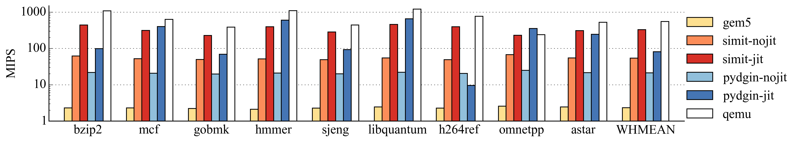
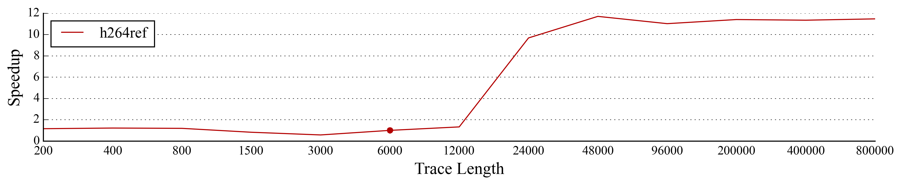
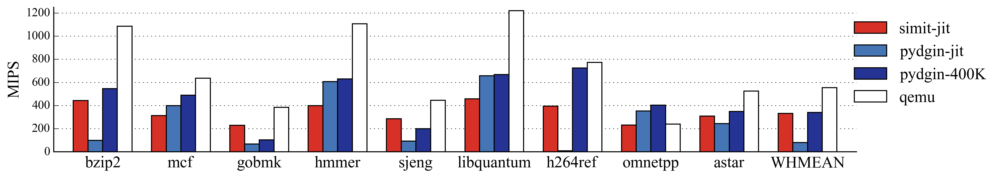

===============================================================================
Pydgin: Using RPython to Generate Fast Instruction-Set Simulators
===============================================================================

**Note:** This is a guest blog post by Derek Lockhart and Berkin Ilbeyi from
Computer Systems Laboratory of Cornell University.

In this blog post I'd like to describe some recent work on using the RPython
translation toolchain to generate fast instruction set simulators.
Our open-source framework, Pydgin [a]_, provides a domain-specific
language (DSL) embedded in Python for concisely describing instruction set
architectures [b]_ and then uses these descriptions to generate fast,
JIT-enabled simulators.
Pydgin will be presented at the *IEEE International Symposium on Performance
Analysis of Systems and Software (ISPASS)* and in this post we provide a
preview of that work.
In addition, we discuss some additional progress updates that occurred after
the publishing deadline and will not appear in the final paper [1]_.

Our area of research expertise is computer architecture, which is perhaps an
unfamiliar topic for some readers of the PyPy blog.
Below we provide some brief background on hardware simulation in the field of
computer architecture, as well as some context as to why instruction set
simulators in particular are such an important tool.

-------------------------------------------------------------------------------
Simulators: Designing Hardware with Software
-------------------------------------------------------------------------------

For computer architects in both academia and industry, a key step in designing
new computational hardware (e.g., CPUs, GPUs, and mobile system-on-chips) is
simulation [c]_ of the target system.
While numerous models for simulation exist, three classes are particularly
important in hardware design.

**Functional Level** models simulate the *behavior* of the target system.
These models are useful for creating a "golden" reference which can serve as an
executable specification or alternatively as an emulation platform for software
development.

**Cycle Level** models aim to simulate both the *behavior* and the approximate
*timing* of a hardware component.
These models help computer architects explore design tradeoffs and quickly
determine things like how big caches should be, how many functional units are
needed to meet throughput targets, and how the addition of a custom accelerator
block may impact total system performance.

**Register-Transfer Level** (RTL) models specify the *behavior*, *timing*, and
*resources* (e.g., registers, wires, logic gates) of a hardware component.
RTL models are bit-accurate hardware specifications typically written in a
hardware description language (HDL) such as Verilog or VHDL.
Once verified through extensive simulation, HDL specifications can be passed
into synthesis and place-and-route tools to estimate area/energy/timing or to
create FPGA or ASIC prototypes.

An *instruction set simulator* (ISS) is a special kind of
*functional-level* model that simulates the behavior of a processor or
system-on-chip (SOC).  ISSs serve an important role in hardware design
because they model the instruction set architecture (ISA) interface: the
contractual boundary between hardware designers and software developers.
ISSs allow hardware designers to quickly experiment with adding new processor
instructions while also allowing software developers to build new compilers,
libraries, and applications long before physical silicon is available.

-------------------------------------------------------------------------------
Instruction-Set Simulators Must be Fast and Productive
-------------------------------------------------------------------------------

Instruction-set simulators are more important than ever because the ISA
boundary has become increasingly fluid.
While `Moore's law`_ has continued to deliver larger numbers of transistors
which computer architects can use to build increasingly complex chips, limits
in `Dennard scaling`_ have restricted how these transistors can be used [d]_.
In more simple terms, thermal constraints (and energy constraints in mobile
devices) have resulted in a growing interest in pervasive *specialization*:
using custom accelerators to more efficiently perform compute intensive tasks.
This is already a reality for designers of mobile SOCs who continually add new
accelerator blocks and custom processor instructions in order to achieve higher
performance with less energy consumption.
ISSs are indispensable tools in this SOC design process for both hardware
architects building the silicon and software engineers developing the software
stack on top of it.

An instruction set simulator has two primary responsibilities: 1) accurately
emulating the external execution behavior of the target, and 2) providing
observability by accurately reproducing the target's internal state (e.g.,
register values, program counter, status flags) at each time step.
However, other qualities critical to an effective ISS are **simulation
performance** and **designer productivity**.
Simulation performance is important because shorter simulation times allow
developers to more quickly execute and verify large software applications.
Designer productivity is important because it allows hardware architects to
easily experiment with adding new instructions and estimate their impact on
application performance.

To improve simulation performance, high-performance ISSs use dynamic binary
translation (DBT) as a mechanism to translate frequently visited blocks of
target instructions into optimized sequences of host instructions.
To improve designer productivity, many design toolchains automatically generate
ISSs from an architectural description language (ADL): a special
domain-specific language for succinctly specifying instruction encodings and
instruction semantics of an ISA.
Very few existing systems have managed to encapsulate the design complexity of
DBT engines such that high-performance, DBT-accelerated ISSs could be
automatically generated from ADLs [e]_.
Unfortunately, tools which have done so are either proprietary software or
leave much to be desired in terms of performance or productivity.

-------------------------------------------------------------------------------
Why RPython?
-------------------------------------------------------------------------------

Our research group learned of the RPython translation toolchain through our
experiences with PyPy, which we had used in conjunction with our Python
hardware modeling framework to achieve significant improvements in simulation
performance [2]_.
We realized that the RPython translation toolchain could potentially be adapted
to create fast instruction set simulators since the process of interpreting
executables comprised of binary instructions shared many similarities with the
process of interpreting bytecodes in a dynamic-language VM.
In addition, we were inspired by PyPy's meta-tracing approach to JIT-optimizing
VM design which effectively separates the process of specifying a language
interpreter from the optimization machinery needed to achieve good performance.

Existing ADL-driven ISS generators have tended to use domain-specific
languages that require custom parsers or verbose C-based syntax that
distracts from the instruction specification.
Creating an embedded-ADL within Python provides several benefits over these
existing approaches including a gentler learning curve for new users, access to
better debugging tools, and easier maintenance and extension by avoiding a
custom parser.
Additionally, we have found that the ability to directly execute Pydgin
ISA descriptions in a standard Python interpreter such as CPython or PyPy
significantly helps debugging and testing during initial ISA exploration.
Python's concise, pseudocode-like syntax also manages to map quite closely to
the pseudocode specifications provided by many ISA manuals [f]_.

-------------------------------------------------------------------------------
The Pydgin embedded-ADL
-------------------------------------------------------------------------------

Defining a new ISA in the Pydgin embedded-ADL requires four primary pieces of
information: the architectural state (e.g. register file, program counter,
control registers), the bit encodings of each instruction, the instruction
fields, and the semantic definitions for each instruction. Pydgin aims to make
this process as painless as possible by providing helper classes and functions
where possible.

For example, below we provide a truncated example of the ARMv5 instruction
encoding table. Pydgin maintains encodings of all instructions in a centralized
``encodings`` data structure for easy maintenance and quick lookup. The
user-provided instruction names and bit encodings are used to automatically
generate decoders for the simulator. Unlike many ADLs, Pydgin does not require
that the user explicitly specify instruction types or mask bits for field
matching because the Pydgin decoder generator can automatically infer decoder
fields from the encoding table.

.. code:: python

  encodings = [
    ['adc',      'xxxx00x0101xxxxxxxxxxxxxxxxxxxxx'],
    ['add',      'xxxx00x0100xxxxxxxxxxxxxxxxxxxxx'],
    ['and',      'xxxx00x0000xxxxxxxxxxxxxxxxxxxxx'],
    ['b',        'xxxx1010xxxxxxxxxxxxxxxxxxxxxxxx'],
    ['bl',       'xxxx1011xxxxxxxxxxxxxxxxxxxxxxxx'],
    ['bic',      'xxxx00x1110xxxxxxxxxxxxxxxxxxxxx'],
    ['bkpt',     '111000010010xxxxxxxxxxxx0111xxxx'],
    ['blx1',     '1111101xxxxxxxxxxxxxxxxxxxxxxxxx'],
    ['blx2',     'xxxx00010010xxxxxxxxxxxx0011xxxx'],
    # ...
    ['teq',      'xxxx00x10011xxxxxxxxxxxxxxxxxxxx'],
    ['tst',      'xxxx00x10001xxxxxxxxxxxxxxxxxxxx'],
  ]

A major goal of Pydgin was ensuring instruction semantic definitions map to ISA
manual specifications as much as possible. The code below shows one such
definition for the ARMv5 ``add`` instruction.
A user-defined ``Instruction`` class (not shown) specifies field names that can
be used to conveniently access bit positions within an instruction (e.g.
``rd``, ``rn``, ``S``).
Additionally, users can choose to define their own helper functions, such as
the ``condition_passed`` function, to create more concise syntax that better
matches the ISA manual.

.. code:: python

  def execute_add( s, inst ):
    if condition_passed( s, inst.cond() ):
      a,   = s.rf[ inst.rn() ]
      b, _ = shifter_operand( s, inst )
      result = a + b
      s.rf[ inst.rd() ] = trim_32( result )

      if inst.S():
        if inst.rd() == 15:
          raise FatalError('Writing SPSR not implemented!')
        s.N = (result >> 31)&1
        s.Z = trim_32( result ) == 0
        s.C = carry_from( result )
        s.V = overflow_from_add( a, b, result )

      if inst.rd() == 15:
        return

    s.rf[PC] = s.fetch_pc() + 4

Compared to the ARM ISA Reference manual shown below, the Pydgin instruction
definition is a fairly close match. Pydgin's definitions could certainly be
made more concise by using a custom DSL, however, this would lose many of the
debugging benefits afforded to a well-supported language such as Python and
additionally require using a custom parser that would likely need modification
for each new ISA.

.. code::

  if ConditionPassed(cond) then
     Rd = Rn + shifter_operand
     if S == 1 and Rd == R15 then
       if CurrentModeHasSPSR() then CPSR = SPSR
     else UNPREDICTABLE else if S == 1 then
       N Flag = Rd[31]
       Z Flag = if Rd == 0 then 1 else 0
       C Flag = CarryFrom(Rn + shifter_operand)
       V Flag = OverflowFrom(Rn + shifter_operand)

Creating an ISS that can run real applications is a rather complex task, even
for a bare metal simulator with no operating system such as Pydgin.
Each system call in the C library must be properly implemented, and
bootstrapping code must be provided to set up the program stack and
architectural state.
This is a very tedious and error prone process which Pydgin tries to
encapsulate so that it remains as transparent to the end user as possible.
In future versions of Pydgin we hope to make bootstrapping more painless and
support a wider variety of C libraries.

.. Architectural state... leave out for now.
.. ::

  class State( object ):
    _virtualizable_ = ['pc', 'ncycles']
    def __init__( self, memory, debug, reset_addr=0x400 ):
      self.pc       = reset_addr
      self.rf       = ArmRegisterFile( self, num_regs=16 )
      self.mem      = memory

      self.rf[ 15 ]  = reset_addr

      # current program status register (CPSR)
      self.N    = 0b0      # Negative condition
      self.Z    = 0b0      # Zero condition
      self.C    = 0b0      # Carry condition
      self.V    = 0b0      # Overflow condition

      # other registers
      self.status        = 0
      self.ncycles       = 0

    def fetch_pc( self ):
      return self.pc

-------------------------------------------------------------------------------
Pydgin Performance
-------------------------------------------------------------------------------

In order to achieve good simulation performance from Pydgin ISSs, significant
work went into adding appropriate JIT annotations to the Pydgin library
components.
These optimization hints, which allow the JIT generated by the RPython
translation toolchain to produce more efficient code, have been specifically
selected for the unique properties of ISSs.
For the sake of brevity, we do not talk about the exact optimizations here but
a detailed discussion can be found in the ISPASS paper [1]_.
In the paper we evaluate two ISSs, one for a simplified MIPS ISA and another
for the ARMv5 ISA, whereas below we only discuss results for the ARMv5 ISS.

The performance of Pydgin-generated ARMv5 ISSs were compared against
several reference ISSs: the gem5_ ARM atomic simulator (*gem5*),
interpretive and JIT-enabled versions of SimIt-ARM_ (*simit-nojit* and
*simit-jit*), and QEMU_.
Atomic models from the gem5 simulator were chosen for comparison due their wide
usage amongst computer architects [g]_.
SimIt-ARM was selected because it is currently the highest performance
ADL-generated DBT-ISS publicly available.
QEMU has long been held as the gold-standard for DBT simulators due to its
extremely high performance, however, QEMU is generally intended for usage as an
emulator rather than a simulator [c]_ and therefore achieves its excellent
performance at the cost of observability.
Unlike QEMU, all other simulators in our study faithfully track architectural
state at an instruction level rather than block level.
Pydgin ISSs were generated with and without JITs using the RPython translation
toolchain in order to help quantify the performance benefit of the meta-tracing
JIT.

The figure below shows the performance of each ISS executing applications from
the SPEC CINT2006 benchmark suite [h]_.
Benchmarks were run to completion on the high-performance DBT-ISSs
(*simit-jit*, *pydgin-jit*, and QEMU), but were terminated after only
10 billion simulated instructions for the non-JITed interpretive ISSs
(these would require many hours, in some cases days, to run to completion).
Simulation performance is measured in MIPS [i]_ and plotted on a **log
scale** due to the wide variance in performance.
The *WHMEAN* group summarizes each ISS's performance across all benchmarks
using the weighted harmonic mean.

A few points to take away from these results:

- ISSs without JITs (*gem5*, *simit-nojit*, and *pydgin-nojit*) demonstrate
  relatively consistent performance across applications, whereas ISSs with JITs
  (*simit-jit*, *pydgin-jit*, and QEMU) demonstrate much greater
  performance variability from application-to-application.
- The *gem5* atomic model demonstrates particularly miserable performance, only
  2-3 MIPS!
- QEMU lives up to its reputation as a gold-standard for simulator performance,
  leading the pack on nearly every benchmark and reaching speeds of 240-1120
  MIPS.
- *pydgin-jit* is able to outperform *simit-jit* on four of the
  applications, including considerable performance improvements of 1.44–1.52×
  for the applications *456.hmmer*, *462.libquantum*, and *471.omnetpp*
  (managing to even outperform QEMU on *471.omnetpp*).
- *simit-jit* is able to obtain much more consistent performance (230-459
  MIPS across all applications) than *pydgin-jit* (9.6-659 MIPS).  This is
  due to *simit-jit*'s page-based approach to JIT optimization compared to
  *pydgin-jit*'s tracing-based approach.
- *464.h264ref* displays particularly bad pathological behavior in Pydgin’s
  tracing JIT and is the only application to perform worse on *pydgin-jit*
  than *pydgin-nojit* (9.6 MIPS vs. 21 MIPS).

The pathological behavior demonstrated by *464.h264ref* was of particular
concern because it caused *pydgin-jit* to perform even worse than having no
JIT at all. RPython JIT logs indicated that the reason for this performance
degradation was a large number of tracing aborts due to JIT traces growing too
long. However, time limitations before the publication deadline prevented us
from investigating this issue thoroughly.

Since the deadline we've applied some minor bug fixes and made some small
improvements in the memory representation.
More importantly, we've addressed the performance degradation in *464.h264ref*
by increasing trace lengths for the JIT.
Below we show how the performance of *464.h264ref* changes as the
**trace_limit** parameter exposed by the RPython JIT is varied from the default
size of 6000 operations.

By quadrupling the trace limit we achieve an 11x performance improvement in
*464.h264ref*.
The larger trace limit allows the JIT to optimize long code paths that were
previously triggering trace aborts, greatly helping amortize the costs of
tracing.
Note that arbitrarily increasing this limit can potentially hurt performance if
longer traces are not able to detect optimizable code sequences.

After performing similar experiments across the applications in the SPEC
CINT2006 benchmark suite, we settled on a trace limit of 400,000 operations.
In the figure below we show how the updated Pydgin ISS (*pydgin-400K*) improves
performance across all benchmarks and fixes the performance degradation
previously seen in *464.h264ref*. Note that the non-JITted simulators have been
removed for clarity, and simulation performance is now plotted on a
**linear scale** to more clearly distinguish the performance gap between
each ISS.

With these improvements, we are now able to beat *simit-jit* on all but two
benchmarks. In future work we hope to further close the gap with QEMU as well.

-------------------------------------------------------------------------------
Conclusions and Future Work
-------------------------------------------------------------------------------

Pydgin demonstrates that the impressive work put into the RPython translation
toolchain, designed to simplify the process of building fast dynamic-language
VMs, can also be leveraged to build fast instruction set simulators.
Our prototype ARMv5 ISS shows that Pydgin can generate ISSs with performance
competitive to SimIt-ARM while also providing a more productive development
experience: RPython allowed us to develop Pydgin with only four person-months
of work.
Another significant benefit of the Pydgin approach is that any performance
improvements applied to the RPython translation toolchain immediately benefit
Pydgin ISSs after a simple software download and retranslation.
This allows Pydgin to track the continual advances in JIT technology introduced
by the PyPy development team.

Pydgin is very much a work in progress. There are many features we would like
to add, including:

- more concise syntax for accessing arbitrary instruction bits
- support for other C libraries such as glibc, uClibc, and musl
  (we currently only support binaries compiled with newlib)
- support for self-modifying code
- features for more productive debugging of target applications
- ISS descriptions for other ISAs such as RISC-V, ARMv8, and x86
- automatic generation of compilers and toolchains from Pydgin descriptions

In addition, we think there are opportunities for even greater performance
improvements with more advanced techniques such as:

- automatic generation of optimized instruction decoders
- optimizations for floating-point intensive applications
- multiple tracing-JITs for parallel simulation of multicore SOCs
- a parallel JIT compilation engine as proposed by Böhm et al. [3]_

We hope that Pydgin can be of use to others, so if you try it out please let us
know what you think. Feel free to contact us if you find any of the above
development projects interesting, or simply fork the project on GitHub and hack
away!

-- Derek Lockhart and Berkin Ilbeyi

-------------------------------------------------------------------------------
Acknowledgements
-------------------------------------------------------------------------------

We would like to sincerely thank Carl Friedrich Bolz and Maciej
Fijalkowski for their feedback on the Pydgin publication and their
guidance on improving the JIT performance of our simulators. We would also
like to thank for the whole PyPy team for their incredible work on the
PyPy and the RPython translation toolchain.

-------------------------------------------------------------------------------
Footnotes
-------------------------------------------------------------------------------

.. [a] Pydgin loosely stands for [Py]thon [D]SL for [G]enerating
       [In]struction set simulators and is pronounced the same as “pigeon”. The
       name is inspired by the word “pidgin” which is a grammatically simplified
       form of language and captures the intent of the Pydgin embedded-ADL.
       https://github.com/cornell-brg/pydgin
.. [b] Popular instruction set architectures (ISAs) include MIPs, ARM,
       x86, and more recently RISC-V
.. [c] For a good discussion of simulators vs. emulators, please see the
       following post on StackOverflow:
       http://stackoverflow.com/questions/1584617/simulator-or-emulator-what-is-the-difference
.. [d] http://en.wikipedia.org/wiki/Dark_silicon
.. [e] Please see the Pydgin paper for a more detailed discussion of prior work.
.. [f] For more examples of Pydgin ISA specifications, please see the ISPASS
       paper [1]_ or the Pydgin source code on GitHub.

       Pydgin instruction definitions for a simple MIPS-inspired ISA can be
       found here:

       - https://github.com/cornell-brg/pydgin/blob/master/parc/isa.py

       Pydgin instruction definitions for a simplified ARMv5 ISA can be found
       here:

       - https://github.com/cornell-brg/pydgin/blob/master/arm/isa.py

.. [g] gem5 is a cycle-level simulation framework that contains both
       functional-level (atomic) and cycle-level processor models. Although
       primarily used for detailed, cycle-approximate processor simulation,
       gem5's atomic model is a popular tool for many ISS tasks.

       - http://www.m5sim.org/SimpleCPU
.. [h] All performance measurements were taken on an unloaded server-class
       machine.
.. [i] Millions of instructions per second.

.. _gem5: http://www.gem5.org/
.. _SimIt-ARM: http://simit-arm.sourceforge.net/
.. _QEMU: http://wiki.qemu.org/
.. _`Moore's Law`: http://en.wikipedia.org/wiki/Moore%27s_law
.. _`Dennard scaling`: http://en.wikipedia.org/wiki/Dennard_scaling#Recent_breakdown_of_Dennard_scaling

-------------------------------------------------------------------------------
References
-------------------------------------------------------------------------------

.. [1] Derek Lockhart, Berkin Ilbeyi, and Christopher Batten. "Pydgin:
       Generating Fast Instruction Set Simulators from Simple Architecture
       Descriptions with Meta-Tracing JIT Compilers." IEEE Int'l Symp. on
       Performance Analysis of Systems and Software (ISPASS), Mar. 2015.

       - http://csl.cornell.edu/~cbatten/pdfs/lockhart-pydgin-ispass2015.pdf
       - https://github.com/cornell-brg/pydgin

.. [2] Derek Lockhart, Gary Zibrat, and Christopher Batten. "PyMTL: A Unified
       Framework for Vertically Integrated Computer Architecture Research." 47th
       ACM/IEEE Int'l Symp. on Microarchitecture (MICRO-47), Dec. 2014.

       - http://csl.cornell.edu/~cbatten/pdfs/lockhart-pymtl-micro2014.pdf
       - https://github.com/cornell-brg/pymtl

.. [3] I. Böhm, B. Franke, and N. Topham. Generalized Just-In-Time Trace
       Compilation Using a Parallel Task Farm in a Dynamic Binary Translator.
       ACM SIGPLAN Conference on Programming Language Design and Implementation
       (PLDI), Jun 2011.

