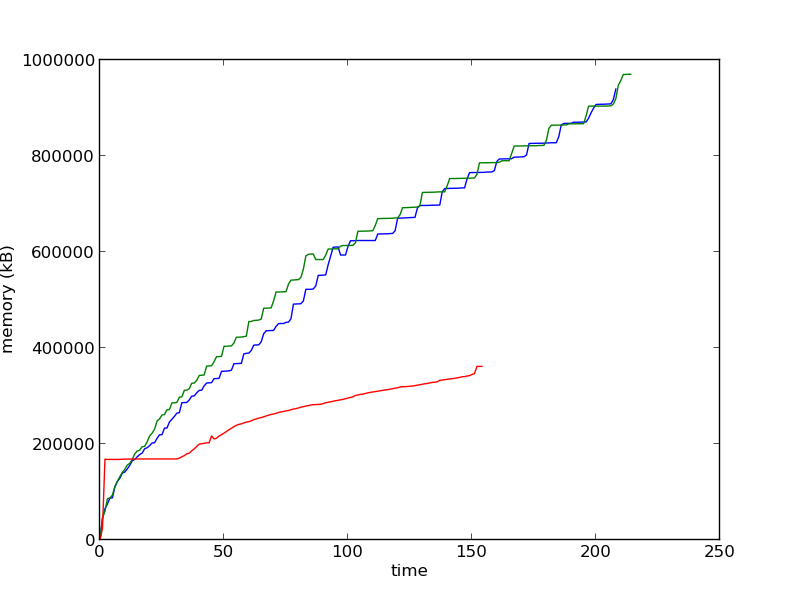

Incremental Garbage Collector in PyPy
=====================================

Hello everyone.

We're pleased to announce that as of today (so tomorrow's nightly),
the default PyPy comes with a GC that has much smaller pauses than yesterday.

Let's start with explaining roughly what GC pauses are. In CPython each
object has a reference count, which is incremented each time we create
references and decremented each time we forget them. This means that objects
are freed each time they become unreachable. That is only half of the story
though. First note that when the last reference to a large tree of
objects goes away, you have a pause: all the objects are freed. Your
program is not progressing at all during this pause, and this pause's
duration can be arbitrarily large. This occurs at deterministic times,
though. But consider code like this::

   class A(object):
        pass

   a = A()
   b = A()
   a.item = b
   b.item = a
   del a
   del b

This creates a reference cycle. It means that while we deleted references to
``a`` and ``b`` from the current scope, they still have a reference count of 1,
because they point to each other, even though the whole group has no references
from the outside. CPython employs a cyclic garbage collector which is used to
find such cycles. It walks over all objects in memory, starting from some known
roots, such as ``type`` objects, variables on the stack, etc. This solves the
problem, but can create noticable, undeterministic GC pauses as the heap
becomes large and convoluted.

PyPy essentially has only the cycle finder - it does not bother with reference
counting, instead it walks alive objects every now and then (this is a big
simplification, PyPy's GC is much more complex than this). Although this might
sound like a missing feature, it is really one of the reasons why PyPy is so
fast, because at the end of the day the total time spent in managing the
memory is lower in PyPy than CPython. However, as a result, PyPy also has the
problem of GC pauses.

To alleviate this problem, which is essential for
applications like games, we started to work on incremental GC, which spreads
the walking of objects and cleaning them across the execution time in smaller
intervals. The work was sponsored by the Raspberry Pi foundation, started
by Andrew Chambers and finished by Armin Rigo and Maciej Fijałkowski.

Benchmarks
==========

Everyone loves benchmarks. We did not measure any significant speed difference
on our quite extensive benchmark suite on speed.pypy.org. The main
benchmark that we used for other comparisons was translating `topaz`_
ruby interpreter using various versions of PyPy and CPython. The exact
command was ``python <pypy-checkout>/bin/rpython -O2 --rtype targettopaz.py``.
Versions:

* topaz - dce3eef7b1910fc5600a4cd0afd6220543104823
* pypy source - defb5119e3c6
* pypy compiled with minimark (non-incremental GC) - d1a0c07b6586
* pypy compiled with incminimark (new, incremental GC) - 417a7117f8d7
* CPython - 2.7.3

The memory usage of CPython, PyPy with minimark and PyPy with incminimark is
shown here. Note that this benchmark is quite bad for PyPy in general, the
memory usage is higher and the amount of time taken is longer. This is due
to JIT warmup being both memory hungry and inefficient. We'll work on it next.
But first, the new GC is not worst than the old one.

The image was obtained by graphing the output of `memusage.py`_.

.. _`topaz`: http://http://docs.topazruby.com/en/latest/
.. _`memusage.py`: https://bitbucket.org/pypy/pypy/src/default/pypy/tool/memusage/memusage.py?at=default

However, the GC pauses are significantly smaller. For PyPy the way to
get GC pauses is to measure time between start and stop while running stuff
with ``PYPYLOG=gc-collect:log pypy program.py``, for CPython, the magic
incantation is ``gc.set_debug(gc.DEBUG_STATS)`` and parsing the output.
For what is worth, the average and total for CPython, as well as the total
number of events are not directly comparable since it only shows the cyclic
collector, not the reference counts. The only comparable thing is the
amount of long pauses and their duration. In the table below, pause duration
is sorted into 8 buckets, each meaning "below or equal the threshold".
The output is generated using `gcanalyze`_ tool.

.. _`gcanalyze`: https://bitbucket.org/pypy/pypy/src/default/rpython/tool/gcanalyze.py?at=default

CPython:

+-------+-------+-------+-------+-------+-------+--------+--------+
|150.1ms|300.2ms|450.3ms|600.5ms|750.6ms|900.7ms|1050.8ms|1200.9ms|
+-------+-------+-------+-------+-------+-------+--------+--------+
|5417   |5      |3      |2      |1      |1      |0       |1       |
+-------+-------+-------+-------+-------+-------+--------+--------+

PyPy minimark (non-incremental GC):

+-------+-------+-------+-------+--------+--------+--------+--------+
|216.4ms|432.8ms|649.2ms|865.6ms|1082.0ms|1298.4ms|1514.8ms|1731.2ms|
+-------+-------+-------+-------+--------+--------+--------+--------+
|27     |14     |6      |4      |6       |5       |3       |3       |
+-------+-------+-------+-------+--------+--------+--------+--------+

PyPy incminimark (new incremental GC):

+------+------+------+------+------+------+-------+-------+
|15.7ms|31.4ms|47.1ms|62.8ms|78.6ms|94.3ms|110.0ms|125.7ms|
+------+------+------+------+------+------+-------+-------+
|25512 |122   |4     |1     |0     |0     |0      |2      |
+------+------+------+------+------+------+-------+-------+

As we can see, while there is still work to be done (the 100ms ones could
be split among several steps), we did improve the situation quite drastically
without any actual performance difference.

Note about the benchmark - we know it's a pretty extreme case of a JIT
warmup, we know we suck on it, we're working on it and we're not afraid of
showing PyPy is not always the best ;-)

Nitty gritty details
====================

Here are some nitty gritty details for people really interested in
Garbage Collection.  This was done as a patch to "minimark", our current
GC, and called "incminimark" for now.  The former is a generational
stop-the-world GC.  New objects are allocated "young", which means that
they initially live in the "nursery", a special zone of a few MB of
memory.  When the nursery is full, a "minor collection" step moves the
surviving objects out of the nursery.  This can be done quickly (a few
millisecond) because we only need to walk through the young objects that
survive --- usually a small fraction of all young objects; and also by
far not *all* objects that are alive at this point, but only the young
ones.  However, from time to time this minor collection is followed by a
"major collection": in that step, we really need to walk all objects to
classify which ones are still alive and which ones are now dead
("marking") and free the memory occupied by the dead ones ("sweeping").
You can read more details here__.

.. __: http://doc.pypy.org/en/latest/garbage_collection.html#minimark-gc

This "major collection" is what gives the long GC pauses.  To fix this
problem we made the GC incremental: instead of running one complete
major collection, we split its work into a variable number of pieces and
run each piece after every minor collection for a while, until there are
no more pieces.  The pieces are each doing a fraction of marking, or a
fraction of sweeping.  It adds some few milliseconds after each of these
minor collections, rather than requiring hundreds of milliseconds in one
go.

The main issue is that splitting the major collections means that the
main program is actually running between the pieces, and so it can
change the pointers in the objects to point to other objects.  This is
not a problem for sweeping: dead objects will remain dead whatever the
main program does.  However, it is a problem for marking.  Let us see
why.

.. __: http://rubini.us/2013/06/22/concurrent-garbage-collection/
.. __: http://wiki.luajit.org/New-Garbage-Collector/01fd5e5ca4f95d45e0c4b8a98b49f2b656cc23dd

In terms of the incremental GC literature, objects are either "white",
"gray" or "black".  This is called *tri-color marking.*  See for example
this `blog post about Rubinius`__, or this `page about LuaJIT`__.  The
objects start as "white" at the beginning of marking; become "gray" when
they are found to be alive; and become "black" when they have been fully
traversed.  Marking proceeds by scanning grey objects for pointers to
white objects.  The white objects found are turned grey, and the grey
objects scanned are turned black.  When there are no more grey objects,
the marking phase is complete: all remaining white objects are truly
unreachable and can be freed (by the following sweeping phase).

In this model, the important part is that a black object can never point
to a white object: if the latter remains white until the end, it will be
freed, which is incorrect because the black object itself can still be
reached.  How do we ensure that the main program, running in the middle
of marking, will not try to write a pointer to white object into a black
object?  This requires a "write barrier", i.e. a piece of code that runs
every time we set a pointer into an object or array.  This piece of code
checks if some (hopefully rare) condition is met, and calls a function
if that is the case.

The trick we used in PyPy is to consider minor collections as part of
the whole, rather than focus only on major collections.  The existing
minimark GC had always used a write barrier of its own to do its job,
like any generational GC.  This existing write barrier is used to detect
when an old object (outside the nursery) is modified to point to a young
object (inside the nursery), which is essential information for minor
collections.  Actually, although this was the goal, the actual write
barrier code is simpler: it just records all old objects into which we
write *any* pointer --- to a young or old object.  As we found out over
time, doing so is not actually slower, and might actually be a
performance improvement: for example, if the main program does a lot of
writes into the same old object, we don't need to check over and over
again if the written pointer points to a young object or not.  We just
record the old object in some list the first time, and that's it.

The trick is that this *unmodified* write barrier works for incminimark
too.  Imagine that we are in the middle of the marking phase, running
the main program.  The write barrier will record all old objects that
are being modified.  Then at the next minor collection, all surviving
young objects will be moved out of the nursery.  At this point, as we're
about to continue running the major collection's marking phase, we
simply add to the list of pending gray objects all the objects that we
just considered --- both the objects listed as "old objects that are
being modified", and the objects that we just moved out of the nursery.
A fraction from the former list were black object; so this mean that
they are turned back from the black to the gray color.  This technique
implements nicely, if indirectly, what is called a "backward write
barrier" in the literature.  The backwardness is about the color that
needs to be changed in the opposite of the usual direction "white ->
gray -> black", thus making more work for the GC.  (This is as opposed
to "forward write barrier", where we would also detect "black -> white"
writes but turn the white object gray.)

In summary, I realize that this description is less about how we turned
minimark into incminimark, and more about how we differ from the
standard way of making a GC incremental.  What we really had to do to
make incminimark was to write logic that says "if the major collection
is in the middle of the marking phase, then add this object to the list
of gray objects", and put it at a few places throughout minor
collection.  Then we simply split a major collection into increments,
doing marking or sweeping of some (relatively arbitrary) number of
objects before returning.  That's why, after we found that the existing
write barrier would do, it was not much actual work, and could be done
without major changes.  For example, not a single line from the JIT
needed adaptation.  All in all it was relatively painless work. ``:-)``
