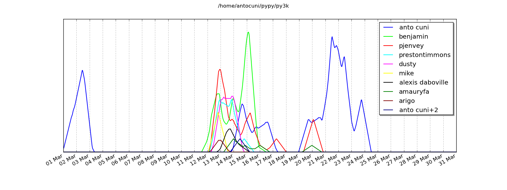

Py3k status update #3
---------------------

This is the third status update about my work on the `py3k branch`_, which I
can work on thanks to all of the people who donated_ to the `py3k proposal`_.

A lot of work has been done during the last month: as usual, the list of
changes is too big to be reported in a detalied way, so this is just a summary
of what happened.

One of the most active areas was killing old and deprecated features. In
particular, we killed support for the ``__cmp__`` special method and its
counsins, the ``cmp`` builtin function and keyword argument for
``list.sort()`` and ``sorted()``.  Killing is easy, but then you have to fix
all the places which breaks because of this, including all the types which
relied on ``__cmp__`` to be comparable,, fixing all the tests which tried to
order objects which are no longer ordeable now, or implementing new behavior
like forbidding calling ``hash()`` on objects which implement ``__eq__`` but
not ``__hash__``.

Among the other features, we killed lots of now-gone functions in the
``operator`` module, the builtins ``apply()``, ``reduce()`` and ``buffer``,
and the ``os.*`` functions to deal with temporary files, which has been
deprecated in favour of the new ``tempfile`` module.

The other topic which can't miss in a py3k status update is, as usual,
string-vs-unicode. At this round, we fixed bugs in string formatting (in
particular to teach ``format()`` to always use unicode strings) and various
corner cases about when calling the (possibly overridden) ``__str__`` method
on subclasses of ``str``. Believe me, you don't want to know the precise rules
:-).

Other features which we worked on and fixed tests include, but are not limited
to, ``marshal``, ``hashlib``, ``zipimport``, ``_socket`` and ``itertools``,
plus the habitual endless lists of tests which fail for shallow reasons such
as the syntactic differences, ``int`` vs ``long``, ``range()`` vs
``list(range())`` etc. As a result, the number of failing tests dropped_ from
650 to 235: we are beginning to see the light at the end of the tunnel :-)

Finally, we did some RPython fixes, so that it is possible again to translate
PyPy in the py3k branch. However, the resuling binary is a strange beast which
mixes python 2 and python 3 semantics, so it is unusable for anything but
`showing friends how cool it's that`_.

I would like to underline that I was not alone in doing all this work. In
particular, a lot of people joined the PyPy sprint at Pycon and worked on the
branch, as you can clearly see in this activity graph. I would like to thank
all who helped!

XXX: benjamin, could you write a quick summary of what you did?

cheers,
Antonio

.. _donated: http://morepypy.blogspot.com/2012/01/py3k-and-numpy-first-stage-thanks-to.html
.. _`py3k proposal`: http://pypy.org/py3donate.html
.. _`py3k branch`: https://bitbucket.org/pypy/pypy/src/py3k
.. _`showing friends how cool it's that`: http://paste.pocoo.org/show/577006/
.. _dropped: http://buildbot.pypy.org/summary?category=linux32&branch=py3k&recentrev=53956:3c8ac35c653a
