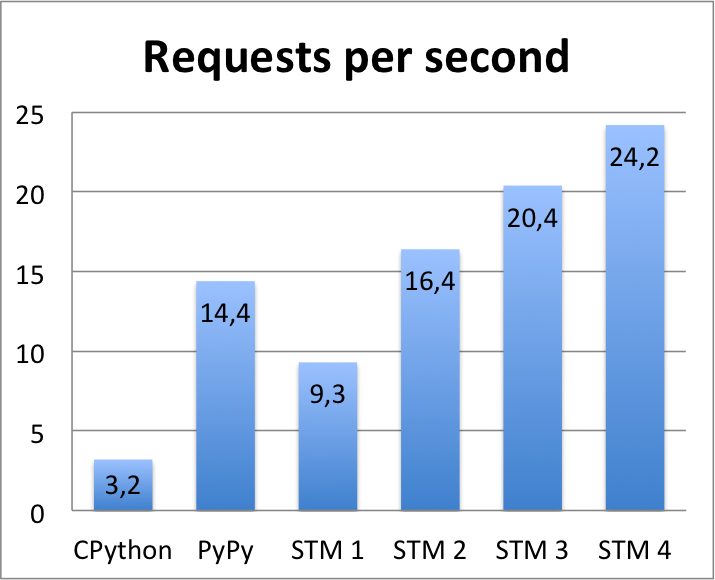

Tornado without a GIL on PyPy STM
=================================

*This post is by Konstantin Lopuhin, who tried PyPy STM during the
Warsaw sprint.*

Python has a GIL, right? Not quite - PyPy STM is a python implementation
without a GIL, so it can scale CPU-bound work to several cores.
PyPy STM is developed by Armin Rigo and Remi Meier,
and supported by community `donations <http://pypy.org/tmdonate2.html>`_.
You can read more about it in the
`docs <http://pypy.readthedocs.org/en/latest/stm.html>`_.

Although PyPy STM is still a work in progress, in many cases it can already
run CPU-bound code faster than regular PyPy, when using multiple cores.
Here we will see how to slightly modify Tornado IO loop to use
`transaction <https://bitbucket.org/pypy/pypy/raw/stmgc-c7/lib_pypy/transaction.py>`_
module.
This module is `described <http://pypy.readthedocs.org/en/latest/stm.html#atomic-sections-transactions-etc-a-better-way-to-write-parallel-programs>`_
in the docs and is really simple to use - please see an example there.
An event loop of Tornado, or any other asynchronous
web server, looks like this (with some simplifications)::

    while True:
        for callback in list(self._callbacks):
            self._run_callback(callback)
        event_pairs = self._impl.poll()
        self._events.update(event_pairs)
        while self._events:
            fd, events = self._events.popitem()
            handler = self._handlers[fd]
            self._handle_event(fd, handler, events)

We get IO events, and run handlers for all of them, these handlers can
also register new callbacks, which we run too. When using such a framework,
it is very nice to have a guaranty that all handlers are run serially,
so you do not have to put any locks. This is an ideal case for the
transaction module - it gives us guaranties that things appear
to be run serially, so in user code we do not need any locks. We just
need to change the code above to something like::

    while True:
        for callback in list(self._callbacks):
            transaction.add(
            self._run_callback, callback)   # added
        transaction.run()                   # added
        event_pairs = self._impl.poll()
        self._events.update(event_pairs)
        while self._events:
            fd, events = self._events.popitem()
            handler = self._handlers[fd]
            transaction.add(                # added
                self._handle_event, fd, handler, events)
        transaction.run()                   # added

The actual commit is
`here <https://github.com/lopuhin/tornado/commit/246c5e71ce8792b20c56049cf2e3eff192a01b20>`_,
- we had to extract a little function to run the callback.

Part 1: a simple benchmark: primes
----------------------------------

Now we need a simple benchmark, lets start with
`this <https://bitbucket.org/kostialopuhin/tornado-stm-bench/src/a038bf99de718ae97449607f944cecab1a5ae104/primes.py?at=default>`_
- just calculate a list of primes up to the given number, and return it
as JSON::

    def is_prime(n):
        for i in xrange(2, n):
            if n % i == 0:
                return False
        return True

    class MainHandler(tornado.web.RequestHandler):
        def get(self, num):
            num = int(num)
            primes = [n for n in xrange(2, num + 1) if is_prime(n)]
            self.write({'primes': primes})

We can benchmark it with ``siege``::

    siege -c 50 -t 20s http://localhost:8888/10000

But this does not scale. The CPU load is at 101-104 %, and we handle 30 %
less request per second. The reason for the slowdown is STM overhead,
which needs to keep track of all writes and reads in order to detect conflicts.
And the reason for using only one core is, obviously, conflicts!
Fortunately, we can see what this conflicts are, if we run code like this
(here 4 is the number of cores to use)::

    PYPYSTM=stm.log ./primes.py 4

Then we can use `print_stm_log.py <https://bitbucket.org/pypy/pypy/raw/stmgc-c7/pypy/stm/print_stm_log.py>`_
to analyse this log. It lists the most expensive conflicts::

    14.793s lost in aborts, 0.000s paused (1258x STM_CONTENTION_INEVITABLE)
    File "/home/ubuntu/tornado-stm/tornado/tornado/httpserver.py", line 455, in __init__
        self._start_time = time.time()
    File "/home/ubuntu/tornado-stm/tornado/tornado/httpserver.py", line 455, in __init__
        self._start_time = time.time()
    ...

There are only three kinds of conflicts, they are described in
`stm source <https://bitbucket.org/pypy/pypy/src/6355617bf9a2a0fa8b74ae17906e4a591b38e2b5/rpython/translator/stm/src_stm/stm/contention.c?at=stmgc-c7>`_,
Here we see that two threads call into external function to get current time,
and we can not rollback any of them, so one of them must wait till the other
transaction finishes.
For now we can hack around this by disabling this timing - this is only
needed for internal profiling in tornado.

If we do it, we get the following results (but see caveats below):

============  =========
Impl.           req/s
============  =========
PyPy 2.4        14.4
------------  ---------
CPython 2.7      3.2
------------  ---------
PyPy-STM 1       9.3
------------  ---------
PyPy-STM 2      16.4
------------  ---------
PyPy-STM 3      20.4
------------  ---------
PyPy STM 4      24.2
============  =========

As we can see, in this benchmark PyPy STM using just two cores
can beat regular PyPy!
This is not linear scaling, there are still conflicts left, and this
is a very simple example but still, it works!

But its not that simple yet :)

First, these are best-case numbers after long (much longer than for regular
PyPy) warmup. Second, it can sometimes crash (although removing old pyc files
fixes it). Third, benchmark meta-parameters are also tuned.

Here we get relatively good results only when there are a lot of concurrent
clients - as a results, a lot of requests pile up, the server is not keeping
with the load, and transaction module is busy with work running this piled up
requests. If we decrease the number of concurrent clients, results get slightly worse.
Another thing we can tune is how heavy is each request - again, if we ask
primes up to a lower number, then less time is spent doing calculations,
more time is spent in tornado, and results get much worse.

Besides the ``time.time()`` conflict described above, there are a lot of others.
The bulk of time is lost in these two conflicts::

    14.153s lost in aborts, 0.000s paused (270x STM_CONTENTION_INEVITABLE)
    File "/home/ubuntu/tornado-stm/tornado/tornado/web.py", line 1082, in compute_etag
        hasher = hashlib.sha1()
    File "/home/ubuntu/tornado-stm/tornado/tornado/web.py", line 1082, in compute_etag
        hasher = hashlib.sha1()

    13.484s lost in aborts, 0.000s paused (130x STM_CONTENTION_WRITE_READ)
    File "/home/ubuntu/pypy/lib_pypy/transaction.py", line 164, in _run_thread
        got_exception)

The first one is presumably calling into some C function from stdlib, and we get
the same conflict as for ``time.time()`` above, but is can be fixed on PyPy
side, as we can be sure that computing sha1 is pure.

It is easy to hack around this one too, just removing etag support, but if
we do it, performance is much worse, only slightly faster than regular PyPy,
with the top conflict being::

    83.066s lost in aborts, 0.000s paused (459x STM_CONTENTION_WRITE_WRITE)
    File "/home/arigo/hg/pypy/stmgc-c7/lib-python/2.7/_weakrefset.py", line 70, in __contains__
    File "/home/arigo/hg/pypy/stmgc-c7/lib-python/2.7/_weakrefset.py", line 70, in __contains__

*Comment by Armin: It is unclear why this happens so far.  We'll investigate...*

The second conflict (without etag tweaks) originates
in the transaction module, from this piece of code::

    while True:
        self._do_it(self._grab_next_thing_to_do(tloc_pending),
                    got_exception)
        counter[0] += 1

*Comment by Armin: This is a conflict in the transaction module itself; ideally,
it shouldn't have any, but in order to do that we might need a little bit
of support from RPython or C code.  So this is pending improvement.*

Tornado modification used in this blog post is based on 3.2.dev2.
As of now, the latest version is 4.0.2, and if we
`apply <https://github.com/lopuhin/tornado/commit/04cd7407f8690fd1dc55b686eb78e3795f4363e6>`_
the same changes to this version, then we no longer get any scaling on this benchmark,
and there are no conflicts that take any substantial time.

*Comment by Armin: There are two possible reactions to a conflict.  We can either
abort one of the two threads, or (depending on the circumstances) just
pause the current thread until the other one commits, after which the
thread will likely be able to continue.  The tool ``print_stm_log.py``
did not report conflicts that cause pauses.  It has been fixed very
recently.  Chances are that on this test it would report long pauses and
point to locations that cause them.*

Part 2: a more interesting benchmark: A-star
--------------------------------------------

Although we have seen that PyPy STM is not all moonlight and roses,
it is interesting to see how it works on a more realistic application.

`astar.py <https://bitbucket.org/kostialopuhin/tornado-stm-bench/src/a038bf99de718ae97449607f944cecab1a5ae104/astar.py>`_
is a simple game where several players move on a map
(represented as a list of lists of integers),
build and destroy walls, and ask server to give them
shortest paths between two points
using A-star search, adopted from `ActiveState recipie <http://code.activestate.com/recipes/577519-a-star-shortest-path-algorithm/>`_.

The benchmark `bench_astar.py <https://bitbucket.org/kostialopuhin/tornado-stm-bench/src/a038bf99de718ae97449607f944cecab1a5ae104/bench_astar.py>`_
is simulating players, and tries to put the main load on A-star search,
but also does some wall building and destruction. There are no locks
around map modifications, as normal tornado is executing all callbacks
serially, and we can keep this guaranty with atomic blocks of PyPy STM.
This is also an example of a program that is not trivial
to scale to multiple cores with separate processes (assuming
more interesting shared state and logic).

This benchmark is very noisy due to randomness of client interactions
(also it could be not linear), so just lower and upper bounds for
number of requests are reported

============  ==========
Impl.           req/s
============  ==========
PyPy 2.4        5 .. 7
------------  ----------
CPython 2.7   0.5 .. 0.9
------------  ----------
PyPy-STM 1      2 .. 4
------------  ----------
PyPy STM 4      2 .. 6
============  ==========

Clearly this is a very benchmark, but still we can see that scaling is worse
and STM overhead is sometimes higher.
The bulk of conflicts come from the transaction module (we have seen it
above)::

    91.655s lost in aborts, 0.000s paused (249x STM_CONTENTION_WRITE_READ)
    File "/home/ubuntu/pypy/lib_pypy/transaction.py", line 164, in _run_thread
        got_exception)

Although it is definitely not ready for production use, you can already try
to run things, report bugs, and see what is missing in user-facing tools
and libraries.

Benchmarks setup:

* Amazon c3.xlarge (4 cores) running Ubuntu 14.04
* pypy-c-r74011-stm-jit for the primes benchmark (but it has more bugs
  than more recent versions), and
  `pypy-c-r74378-74379-stm-jit <http://cobra.cs.uni-duesseldorf.de/~buildmaster/misc/pypy-c-r74378-74379-stm-jit.xz>`_
  for astar benchmark (put it inside pypy source checkout at 38c9afbd253c)
* http://bitbucket.org/kostialopuhin/tornado-stm-bench at 65144cda7a1f
