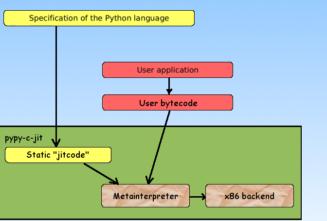

.. include:: beamerdefs.txt

=======================================
PyPy 1.3: status and news
=======================================

Outline
-------

- PyPy 1.3: what's new and status update

- Overview of the JIT

- ``cpyext``: load CPython extensions in PyPy!

Part 0: What is PyPy? :-)
--------------------------

- Python interpreter written in Python

- Framework for developing dynamic languages

- etc. etc.

|pause|

- From the user point of view

- An alternative to CPython

- with more features!

Part 1
-------

- What's new and status update

What's new in PyPy 1.2, 1.3
---------------------------

- 1.2: released on March 12th, 2010

  * Main theme: speed

  * JIT compiler

  * speed.pypy.org

- 1.3: released on June 26th, 2010

  * Stability: lot of bugfixes, thanks for the feedback :-)

  * More speed!

  * cpyext

- Binaries for Linux, Windows, Mac

- Ubuntu packages

Speed: PyPy vs CPython
-----------------------

Speed: PyPy vs Psyco
-----------------------

What works on PyPy
-------------------

- Pure Python modules should Just Work (TM)

  * django trunk

  * twisted, nevow

  * pylons

  * bittorrent

  * ...

|pause|

- lot of standard modules

|scriptsize|

  * __builtin__ __pypy__ _codecs _lsprof _minimal_curses _random _rawffi
    _socket _sre _weakref bz2 cStringIO crypt errno exceptions fcntl gc
    itertools marshal math md5 mmap operator parser posix pyexpat select sha
    signal struct symbol sys termios thread time token unicodedata zipimport
    zlib

  * array binascii cPickle cmath collections ctypes datetime functools grp md5
    pwd pyexpat sha sqlite3 syslog

|end_scriptsize|

  * ctypes

What does not work on PyPy
--------------------------

- Pure Python modules should Just Work (TM) |pause|

  * ... unless they don't :-)

|pause|

- Programs that rely on CPython-specific behavior

  * refcounting: ``open('xxx', 'w').write('stuff')``

  * non-string keys in dict of types (try it!)

  * exact naming of a list comprehension variable

  * exact message matching in exception catching code

  * ...

|pause|

- Extension modules

  * try cpyext!

Speed: Demo
-----------

- Django application

- Mandelbrot fractal

  * fished randomly on the net :-)

- Run both on CPython and PyPy

  * django trunk!

Mandelbrot demo
---------------

- Works purely on PyPy

- Not always the case

  * missing extension modules (cpyext mitigates the problem)

  * libraries that rely on CPython details
    
  * ...

- clear performance-critical part

CPython and PyPy side by side
------------------------------

- CPython: runs the main application

- PyPy: subprocess, runs only the hotspots

- How do they communicate?

- execnet

  * **The Ring of Python**, Holger Krekel, 9:45

  * oups, too late :-)

Rendering (1)
---------------

|example<| Mandelbrot |>|
|small|

.. sourcecode:: python

    def render(request):
        w = int(request.GET.get('w', 320))
        h = int(request.GET.get('h', 240))

        from py_mandel import mandelbrot
        img = mandelbrot(w, h)

        return HttpResponse(img, content_type="image/bmp")

|end_small|
|end_example|

Rendering (2)
-------------

|example<| Mandelbrot on PyPy |>|
|small|

.. sourcecode:: python

    def pypy_render(request):
        w = int(request.GET.get('w', 320))
        h = int(request.GET.get('h', 240))

        channel = pypy.remote_exec("""
            from py_mandel import mandelbrot
            w, h = channel.receive()
            img = mandelbrot(w, h)
            channel.send(img)
        """)
        channel.send((w, h))
        img = channel.receive()

        return HttpResponse(img, content_type="image/bmp")

|end_small|
|end_example|

execnet setup
-------------

|example<| At startup |>|
|small|

.. sourcecode:: python

    import execnet
    mygroup = execnet.Group()
    pypy = mygroup.makegateway("popen//python=pypy-c")
    pypy.remote_exec("""
        import sys
        import os
        os.chdir("mandelbrot")
        sys.path.insert(0, '')
    """)

|end_small|
|end_example|

Demo
----

Benchmarks
----------

.. image:: demo-graph.pdf
   :scale: 45

Part 2: Just-in-Time compilation
---------------------------------

  Snakes never crawled so fast

Overview of implementations
---------------------------

- CPython
- Stackless
- Psyco
- Jython
- IronPython
- PyPy (without and with JIT)
- Unladen Swallow

Demo
----

Features
--------

- it just works
- it may give good speed-ups (better than Psyco)
- it may have a few bugs left (Psyco too) |pause|
- *it is not a hack (unlike Psyco)*

|pause|

- PyPy also has excellent memory usage

  * half that of CPython for a program
    using several hunderds MBs

What is a JIT
-------------

* CPython compiles the program source into *bytecodes*

* without a JIT, the bytecodes are then interpreted

* with a JIT, the bytecodes are further translated to
  machine code (assembler)

What is a JIT (2)
-----------------

The translation can be:

* syntactic: translate the whole functions into machine code

  - "the obvious way"
  - e.g. Pyrex/Cython, Unladen Swallow
  - not good performance, or needs tricks |pause|

* semantic: translate bits of the function just-in-time

  - only used parts
  - exploit runtime information (e.g. types)
  - Psyco, PyPy

What is a tracing JIT
---------------------

* start by interpreting normally
* find loops as they are executed
* turn them into machine code
* 80% of the time is spent in 20% of the code

What is a tracing JIT (history)
-------------------------------

* tracing assembler (Dynamo, ~2000)
* tracing Java (~2005)
* tracing JavaScript (~2008)

|pause|

* PyPy is a "tracing JIT generator"

The architecture of PyPy
------------------------

The architecture of PyPy (2)
----------------------------

Speed of the PyPy JIT
---------------------

Python programs that are, or are not, nicely handled
by the JIT:

- loops, even across many calls, are nicely handled

- loops with very many taken paths are not

  * e.g. Python programs that look like interpreters
  * typical in tracing JITs

- bad support so far for generators and recursion

The optimizations we get
------------------------

- ``!=`` optimizations we *wrote* :-)

- removed frame handling

  - local variables are in CPU registers or on the C stack
  - but ``sys._getframe()`` works correctly

- "virtuals": temporary objects are not constructed

  - ``e = a + b + c + d``
  - and much more complex examples

- attribute and method lookups, etc.

Example
-------------

|column1|

|example<| |>|

.. sourcecode:: python
    
    def g(a, b):
      if a < 5:      # 2
        return -1
      return a - b   # 3

    def f(x):
      total = 0      
                     # 1
      for i in range(x):
        d = g(i, x)
        total += d   # 4

|end_example|

|column2|

|example<| |>|

.. sourcecode:: nasm

    ADD EAX, 1
    CMP EAX, EBX
    JNL <guard 1>
    CMP EAX, 0
    JL <guard 2>
    MOV ECX, EAX
    SUB ECX, EBX
    JO <guard 3>
    ADD EDX, ECX
    JO <guard 4>
    JMP

|end_example|

|end_columns|

Practical results
-----------------------

- fast :-)

- so far, x86-32 only

- relatively easy to maintain (or port to x86-64, etc.)

- reminder: works transparently for *any* Python code

  * or any language (Prolog JIT :-) at PPDP 2010)

- viable alternative to CPython

Part 3
------

cpyext

cpyext
------

- CPython extension modules in PyPy

- ``pypy-c setup.py build``

- included in PyPy 1.3

- still beta

- 50% of the CPython API is supported

  * enough for 90% of extension modules

features
--------

- C API written in Python!

- Testable on top of an interpreted py.py

- Written on top of the object space

- Source compatibility

  * PyString_AS_STRING is actually a function call (instead of a macro)

|small|

.. sourcecode:: python

    @cpython_api([PyObject], Py_ssize_t, error=-1)
    def PyDict_Size(space, w_obj):
        return space.int_w(space.len(w_obj))

|end_small|

implementation
--------------

- It was not supposed to work!

  * different garbage collector

  * no "borrowed reference"

  * all the PyTypeObject slots

- *not* faster than python code!

- PyObject contains ob_type and ob_refcnt

  * The "abstract object interface" is used.

- Some objects contain more:

  * PyString_AsString() must keep the buffer alive at a fixed location

  * PyTypeObject exposes all its fields

The Reference Counting Issue
----------------------------

- pypy uses a moving garbage collector, starts with static roots to
  find objects.

- CPython objects don't move, and PyObject* can point to deallocated
  memory.

- cpyext builds PyObject as proxies to the "real" interpreter objects

- one dictionary lookup each time the boundary is crossed

- More tricks needed for borrowing references

  * The object lifetime is tied to its container.

  * "out of nothing" borrowed references are kept until the end of the
    current pypy->C call.

supported modules
------------------

- Known to work (after small patches):

  * wxPython

  * _sre

  * PyCrypto

  * PIL

  * cx_Oracle

  * MySQLdb

  * sqlite

Why your module will crash
---------------------------

Likely:

|small|

.. sourcecode:: c

     static PyObject *myException;

     void init_foo() {
         myException = PyException_New(...);
         Py_AddModule(m, myException); // steals a reference
     }

     {
         PyErr_SetString(myException, "message"); // crash
     }

|end_small|

wxPython on PyPy (1)
---------------------

wxPython on PyPy (2)
---------------------

performance (1)
---------------

|small|

.. sourcecode:: python

    from cx_Oracle import connect, STRING
    c = connect('scott/tiger@db')
    cur = c.cursor()
    var = cur.var(STRING)

    def f():
        for i in range(10000):
            var.setvalue(0, str(i))
            var.getvalue(0)

.. sourcecode:: bash

    python -m timeit -s "from test_oracle import f" "f()"
    python2.6:    8.25 msec per loop
    pypy-c:     161    msec per loop
    pypy-c-jit: 121    msec per loop

|end_small|

performance (2)
---------------

Compare with:

|small|

.. sourcecode:: python

    def f():
        for i in range(10000):
            x = str(i)
            y = int(x)

.. sourcecode:: bash

    python2.6:    8.18 msec per loop
    pypy-c-jit:   1.22 msec per loop

|end_small|

Future developments
-------------------

- Some care about speed

  * The JIT can help to remove (some of) the overhead

- Fill missing API functions (when needed)

- Better suppport of the PyTypeObject slots

- Think about threads and the GIL

- Think about reference cycles

Contact / Q&A 
--------------

* Antonio Cuni: at http://merlinux.eu

* Armin Rigo: arigo (at) tunes.org

* Amaury Forgeot d'Arc: amauryfa (at) gmail

* And the #pypy IRC channel on freenode.net!

* Links:

  - PyPy: http://pypy.org/

  - PyPy speed center: http://speed.pypy.org/

  - Blog: http://morepypy.blogspot.com
