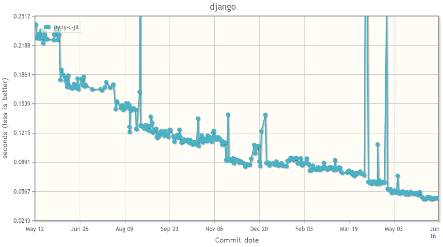
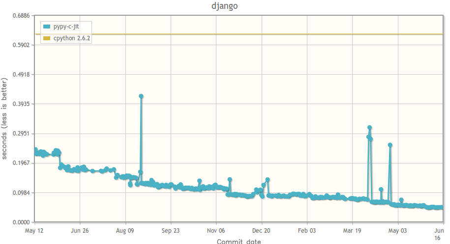

.. include:: beamerdefs.txt

================================
PyPy in production
================================

What is PyPy?
-------------

|pause|

* Past EuroPython talks:

  - |scriptsize| **2004**: PyPy

  - **2005**: PyPy as a compiler

  - **2006**: An introduction to PyPy, PyPy architecture session, What can PyPy do for you

  - **2007**: PyPy 1.0 and Beyond, PyPy Python Interpreter(s) Features, PyPy: Why and
    how did it (not) work?

  - **2008**: PyPy for the rest of us, PyPy status talk

  - **2009** PyPy: Complete and Fast

  - **2010**: PyPy 1.3: Status and News |end_scriptsize|

|pause|

* You should know by now :-)

What is PyPy? (seriously)
-------------------------

* PyPy

  - started in 2003

  - Open Source, partially funded by EU and others

  - framework for fast dynamic languages

  - **Python implementation**

* as a Python dev, you care about the latter

PyPy 1.5
---------

* Releseased on 30 April, 2011

* Python 2.7.1

* The most compatible alternative to CPython

* Most programs just work

* (C extensions might not)

|pause|

* **fast**

Speed
------

.. image:: pypy-vs-cpython.png
   :scale: 40%
   :align: center

Improvements in the past year
------------------------------

Compare to CPython
-------------------

Not convinced yet?
------------------

|example<| Real time edge detection |>|
|small|

.. sourcecode:: python

    def sobeldx(img):
      res = img.clone(typecode='d')
      for p in img.pixeliter():
          res[p] = (-1.0 * img[p + (-1,-1)] +
                     1.0 * img[p + ( 1,-1)] +
                    -2.0 * img[p + (-1, 0)] +
                     2.0 * img[p + ( 1, 0)] +
                    -1.0 * img[p + (-1, 1)] +
                     1.0 * img[p + ( 1, 1)]) / 4.0
      return res
    ...
    ...

|end_small|
|end_example|

