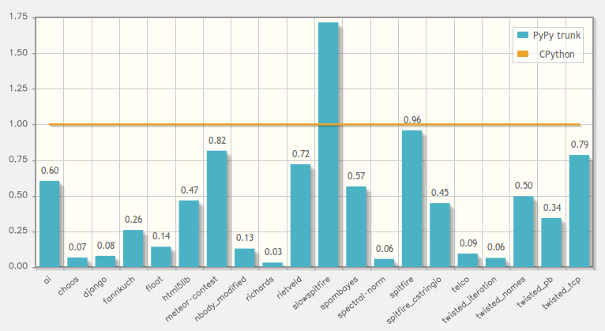

.. include:: beamerdefs.txt

================================
PyPy training session
================================

What is PyPy?
-------------------------

* PyPy

  - started in 2003

  - Open Source, partially funded by EU and others

  - framework for fast dynamic languages

  - Python implementation

Speed
------

PyPy training session
---------------------

- Part 1: Run your application under PyPy

- Part 2: Write your own interpreter with PyPy

How to run PyPy
----------------

* ``pypy program.py``

* That's it!

  - (modulo details)

Challenge
---------

* ``html_fibo.py``

* HTML list of fibonacci numbers

* (the most complicate ever)

* run it on CPython

* run it on PyPy

* fix it!

Just-in-Time Compilation
------------------------

* Tracing JIT, like TraceMonkey

* Complete by construction

* Supports Intel x86, amd64, and soon ARM

Short introduction to JITting
-----------------------------

* run code with the interpreter

* observe what it does

* generate optimized machine code for commonly executed paths

* using runtime knowledge (types, paths taken)

Tracing JIT
-----------

* compiles one loop at a time

* generates linear code paths, recording what the interpreter did

* for each possible branch, generate a guard, that exits assembler on triggering

* if guard fails often enough, start tracing from the failure

Meta-Tracing in PyPy
--------------------

* The explanation above assumes a tracing JIT for the full Python
  language

* Would need to be maintained whenever we change the Python version we
  support

* Instead, we have a "meta-tracing JIT"

* A very important point for us since we don't have a huge team
  to implement all Python semantics for the JIT

* We trace the python interpreter's main loop (running N times) interpreting
  a python loop (running once)

PYPYLOG
--------

|small|

* ``PYPYLOG=categories:logfile pypy program.py``

|end_small|

* categories:

  - gc-minor, gc-major

  - jit-log-noopt, jit-log-opt

  - jit-backend

  - jit-backend-counts

Inspecting the JIT log
-----------------------

|scriptsize|
|example<| |scriptsize| ``count.py`` |end_scriptsize| |>|

.. sourcecode:: python

    def count_mult_of_5(N):
        mult = 0
        not_mult = 0
        for i in range(N):
            if i % 5 == 0:
                mult += 1
            else:
                not_mult += 1
        return mult, not_mult

|end_example|
|end_scriptsize|

|small|

* ``PYPYLOG=jit-log-opt:mylog pypy count.py 2000``

* ``PYPYLOG=jit-log-opt:mylog pypy count.py 10000``

|end_small|

The jitviewer
-------------

|scriptsize|

* ``PYPYLOG=jit-log-opt,jit-backend-counts:mylog pypy count.py 2000``

* ``PYPYLOG=jit-log-opt,jit-backend-counts:mylog pypy count.py 10000``

* ``jitviewer.py log.pypylog``

* Look at the (missing) bridge!

|end_scriptsize|
