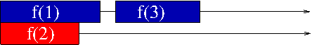

.. include:: beamerdefs.txt

============================================
PyPy: current status and the GIL-less future
============================================

PyPy at EuroPython
------------------

|scriptsize|

::

  fijal@helmut:~/src/extradoc/talk$ cd ep20

  ep2004-pypy/ ep2006/      ep2008/      ep2010/      ep2012/

  ep2005/      ep2007/      ep2009/      ep2011/

|end_scriptsize|

|pause|

* for those who missed previous EPs, PyPy is a Python interpreter
  with a JIT.

Software archeology
-------------------

|small|

   "single functions doing integer arithmetic get great speed-ups; about
   anything else will be a bit slower with the JIT than without.  We are
   working on this - you can even expect quick progress, because it is mostly
   a matter of adding a few careful hints in the source code of the Python
   interpreter of PyPy."

                                (status of the JIT of PyPy as of March 2007)

                                
|end_small|

Software archeology
-------------------

* Around since 2003

* (advertised as) production ready since December 2010

  - release 1.4

* Funding

  - EU FP6 programme

  - Eurostars programme

  - donations

  - ...

PyPy 1.9: current status
------------------------

* Faster

  - **1.7x** than 1.5 (a year ago)

  - **2.2x** than 1.4

  - **5.5x** than CPython

* Implements Python 2.7.2

  - py3k in progress (see later)

* Many more "PyPy-friendly" programs

* Packaging

  - |scriptsize| Debian, Ubuntu, Fedora, Homebrew, Gentoo, ArchLinux, ... |end_scriptsize|

  - |scriptsize| Windows (32bit only), OS X |end_scriptsize|

* C extension compatibility

  - from "alpha" to "beta"

  - runs (big part of) **PyOpenSSL** and **lxml**

PyPy organization
-----------------

* Part of Software Freedom Conservancy

  - Bradley successfully fighting U.S. bureaucracy

  - we are happy about it

* Funding model

  - py3k, numpy, STM

  - more than 100'000$ in donations

  - from individuals, large companies and the PSF

  - **thank to all**

Let's talk about Python
-----------------------

* Rapid prototyping

  - run your web server in 3 seconds

  - run your script in 0.1s

* Glue language

  - integrating with C is "easy"

Let's talk about PyPy
---------------------

* JIT warmup time

  - significant

  - rapid prototyping is harder

* no good way to call C from PyPy (yet)

JIT warmup times
----------------

* JIT-ted code: very fast

* Everything else: slow

* JIT-ting one piece at a time

* "takes a while"

* **Cannot** cache JIT-ted code between runs

|pause|

* We did not spend much time on this

* Come and talk to us

* **PyPy JIT Under the hood**

  - July 4 2012

.. XXX what do we want to say in "come and talk to us"?

Py3k status
-----------

* ``py3k`` branch in mercurial

  - RPython toolchain vs Python interpreter

  - developed in parallel

  - not going to be merged

* Focus on correctness

* No JIT for now

  - we just did no try :-)

* Dropped some interpreter optimizations for now

|pause|

* Major features already implemented

  - string vs unicode

  - int/long unification

  - syntactic changes (``print()``, ``except``, etc.)

* Tons of small issues left

* What's new:

    - print function

    - view and iterators instead of lists

    - function annotations

    - keyword only arguments

    - ``nonlocal``

    - extended iterable unpacking

    - dictionary comprehensions

    - set, oct, binary, bytes literals

    - ``raise ... from ...``

    - new metaclass syntax

    - Ellipsis: ``...``

    - lexical exception handling, ``__traceback__``, ``__cause__``, ...

    ...

    - ``__pycache__``

.. in january: 1621 failing own tests
   now 83

* Removed syntax:

  - tuple parameter unpacking, backticks, ``<>``, ``exec``, ``L`` and ``u``, ...

NumPy
-----

* progress going slowly

* multi dimensional arrays, broadcasting, fancy indexing

* all dtypes, except complex, strings and objects

* tons of functions missing

* you can help!

Calling C
---------

.. image:: standards.png
   :scale: 60%
   :align: center

Calling C landscape
-------------------

* CPython C extensions

* SWIG, SIP, wrapper generators

* ctypes

* Cython

* CFFI (our new thing)

CFFI
----------

|scriptsize|
|example<| Example |>|

  .. sourcecode:: pycon

   >>> from cffi import FFI
   >>> ffi = FFI()
   >>> ffi.cdef("""
   ...     int printf(const char *format, ...);
   ... """)
   >>> C = ffi.dlopen(None)
   >>> arg = ffi.new("char[]", "world")
   >>> C.printf("hi there, %s!\n", arg)
   hi there, world!

|end_example|
|end_scriptsize|

CFFI
----

* Many more examples

* Including macro calls and most subtleties of C

STM
---------------------------

* Software Transactional Memory

* "Remove the GIL"

Problem
-------

* One Python program == one core

* Even with threads

Does it matter?
---------------

* "My script runs anyway in 0.1 seconds"

|pause|

* Python getting exponentially slower?

Does it matter?
---------------

* "I can have several processes exchanging data"

|pause|

* A special-case solution only

pypy-stm
--------

* A Python without the GIL

* not the first one:

  - Python 1.4 patch (Greg Stein, 1996)

  - Jython

  - IronPython

* Demo

STM
---

*Transactions,* similar to database transactions

* GIL

* STM

Conflicts
---------

Occasional conflict:

.. raw:: latex

   \vspace{1cm}

HTM
---

* Hardware support: Intel Haswell, 2013

* "CPython-htm"?

* Removing the GIL: suddenly around the corner

The catch
---------

|pause|

You have to use threads

Threads
-------

* Messy

* Hard to debug, non-reproductible

* Parallel with Explicit Memory Management:

  - messy, hard to debug rare leaks or corruptions

  - automatic GC solves it

  - (like in Python)

This talk is really about...
----------------------------

* Multicore usage *without using threads*

* Demo with the "transaction" module

How?
----

* Longer, controlled transactions

* GIL

* STM

Results
-------

* Same results in both cases

* i.e. can pretend it is one-core

The opposite catch
------------------

* Always gives correct results...

* But maybe too many conflicts

  - up to: systematic conflicts

|pause|

* This still approaches the issue from "the right side"

About CPython
-------------

* Long transactions: HTM too limited

* At least for the next 10-15 years

* On CPython we are stuck with threads

  - for the next 10-15 years

Summary
-------

* STM fine with PyPy, but HTM required for CPython

* HTM too limited for long transactions

* Long transactions give a better programming model

* For years to come, only in PyPy

  - Unless major effort from CPython devs

Conclusion
----------

* The GIL will be removed soon

* But for the foreseeable future, Python programmers stuck with using threads

Conclusion
----------

* ...while other langs get the better programming model

  - My own point of view only

  |pause|

  - Or maybe everybody will switch to PyPy

Thank you
---------

http://pypy.org/
