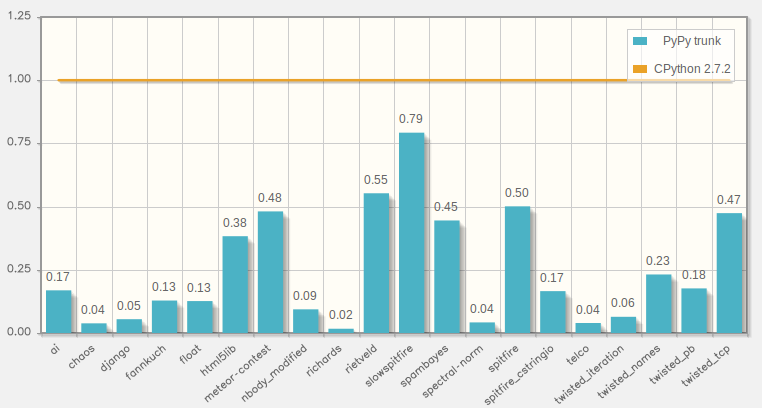

.. include:: beamerdefs.txt

================================
PyPy Status
================================

Who Am I
--------

* rguillebert on twitter and irc

* GSoC student on PyPy/Cython

* PyPy contributor since 2011

* Worked on Py3k and Numpy

PyPy is not dead
----------------

- No PyPy status talk at EuroPython 2013

  * for the first time since 2004!

  * for no good reason :)

- PyPy is healthy and alive

|pause|

- WARNING: This talk is boring

  * "it just works"

What is PyPy?
--------------

* RPython toolchain

  - subset of Python

  - ideal for writing VMs

  - JIT & GC for free

* Python interpreter

  - written in RPython

  - **FAST**

* Whatever (dynamic) language you want

  - smalltalk, prolog, PHP, javascript, ...

PyPy: past two years (1)
-----------------------------

- PyPy 2.0 (May 2013)

  * beta ARM, CFFI, unicode performance

  * stackless + JIT (eventlet, gevent, ...)

|pause|

- PyPy 2.1 (July 2013)

  * stable ARM

  * py3k (3.2.3), numpy, general improvements, bugfixes

|pause|

- PyPy 2.2 (November 2013)

  * incremental GC, faster JSON

  * more JIT, more py3k

  * more numpy, numpy C API

PyPy: past two years (2)
-------------------------

- PyPy 2.3 (May 2014)

- Lot of internal refactoring

- C API for embedding

  * pypy + uWSGI (thanks to Roberto De Ioris)

- the usual, boring, general improvements

More PyPy-powered languages
----------------------------

- RPython: general framework for dynamic languages

- Topaz: implementing Ruby

  * most of the language implemented

  * "definitely faster than MRI"

  * https://github.com/topazproject/topaz

- HippyVM: implementing PHP

  * ~7x faster than standard PHP

  * comparable speed as HHVM

  * http://hippyvm.com/

Fundraising campaign
---------------------

- py3k: 52'000 $ of 105'000 $ (50%)

- numpy: 48'000 $ of 60'000 $ (80%)

- STM, 1st call: 25'000 $

- STM, 2nd call: 3'000 $ of 80'000 $ (4%)

- thank to all donors!

Commercial support
------------------

- We offer commercial support for PyPy

- Consultancy and training

- Performance issues for open- or closed-source programs, porting,
  improving support in parts of the Python or non-Python interpreters,
  etc.

- http://baroquesoftware.com

Current status
---------------

- Python code: "it just works"

- C code: better than ever!

  * cpyext: more complete, but still slow

  * CFFI: the future

  * Native PyPy C API for embedding

  * cppyy for C++

- Lots of CFFI modules around:

  * pygame_cffi, psycopg2_cffi, lxml

- numpy: in-progress (more later)

Speed: 6.5x faster than CPython
--------------------------------

ARM
----

- Official support since PyPy 2.1

- "it just works"

- ~7.5x faster than CPython on ARM

- thanks to Raspberry-Pi foundation

- distributed as part of Raspbian OS

numpy
-----

- as usual, in-progress

- ~80% of numpy implemented

  * 2336 passing tests out of 3265

  * http://buildbot.pypy.org/numpy-status/latest.html

- just try it

- no scipy :-/

py3k
----

- 3.2: stable

- 3.3: branch started, in-progress

- some missing optimizations

  * getting better

CFFI
-----

- Python <-> C interfacing done right

  * existing shared libraries

  * custom C code

- Inspired by LuaJIT's FFI

- Alternative to C-API, ctypes, Cython, etc.

- Fast on CPython, super-fast on PyPy

cppyy
------

- Interface to C++

- Based on reflection, no need to write wrappers

- PyPy-only, similar to PyCintex for CPython

- Main use case: ROOT

  * http://root.cern.ch

  * "a set of OO frameworks with all the functionality needed to handle and
    analyze large amounts of data in a very efficient way"

- 3x faster than CPython

The future: STM
----------------

- Software Transactional Memory

- Strategy to solve race conditions

- "Finger crossed", rollback in case of conflicts

- On-going research project

  * by Armin Rigo and Remi Meier

Current status for STM
----------------------

- Preliminary versions of pypy-jit-stm available

- The overhead is still a bit too high and hard to predict

- Lots of polishing needed

- More fundamentally, how to best use it is still unknown

- See talk tomorrow

Contacts, Q&A
--------------

- http://pypy.org

- http://morepypy.blogspot.com/

- #pypy@freenode.net

- Any question?
