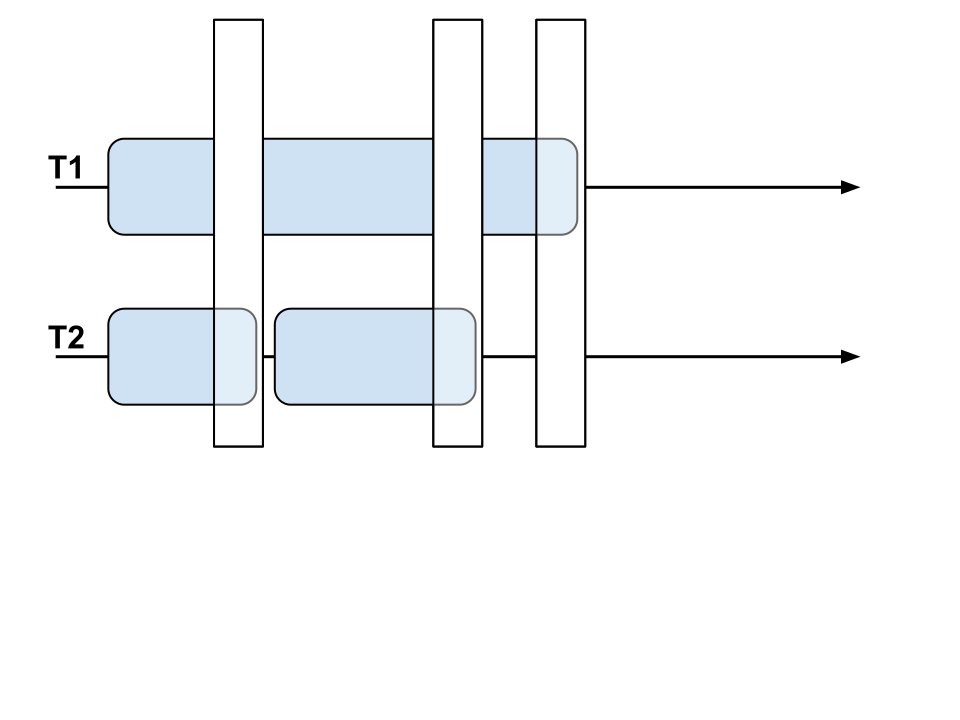

------------------------------------------------------------------------------
Using All These Cores: Transactional Memory in PyPy
------------------------------------------------------------------------------

.. raw:: html

    

**Armin Rigo - EuroPython 2014**

.. raw:: html

    

Part 1 - Intro and Current Status
---------------------------------

Why is there a GIL?
-------------------

* GIL = Global Interpreter Lock

* initially: CPython was single threaded

* for concurrency (but not parallelism):

  - provide concurrently running threads

* easiest way to retrofit into interpreter:

  - acquire GIL around the execution of bytecode instructions

  - easy for refcounting, too

Consequences (+)
----------------

* atomic & isolated instructions:

  - things like ``list.append()`` are atomic
  - tons of websites mention this
  - latent races if Python becomes really parallel

* sequential consistency:

  - less surprises; "all variables volatile"

Consequences (-)
----------------

* obviously, no parallelism

* GIL not available to application:
    
  - all difficulties of concurrency still there
  - need application-level locking

Removing the GIL
----------------

* 1. Fine-grained locking

* 2. Shared-nothing

* 3. Transactional memory

Fine-grained locking
--------------------

* replace GIL with locks on objs / data structures

* accessing different objects can run in parallel

* harder to implement:

  - many locks -> deadlock risks
  - refcounting issue

* overhead of lock/unlock on objs:

  - Jython depends on JVM for good lock removal

* still need application-level locking

Shared-nothing
--------------

* each independent part of the program gets its own interpreter

* simple implementation

* gives workaround instead of direct replacement

* not compatible to existing threaded applications, a priori

* explicit communication:

  - good: clean model, no locks
  - bad: limitations, overhead

Transactional Memory
--------------------

* like GIL, but instead of locking, each thread runs optimistically

* "easy" to implement:

  - GIL acquire -> transaction start

  - GIL release -> transaction commit

* overhead: cross-checking conflicting memory reads and writes,
  and if necessary, cancel and restart transactions

* HTM, STM, or some hybrids exist:
    
  - but mostly still research-only

Big Point
----------------------------

* application-level locks still needed...

* but *can be very coarse:*

  - the idea is to make sure, internally, that one transaction
    covers the whole time during which the lock was acquired

  - even two big transactions can hopefully run in parallel

  - even if they both acquire and release the *same* lock

Big Point
---------

Demo 1
------

* Bottle web server

PyPy-STM
--------

* implementation of a specially-tailored STM:
    
  - a reusable C library
  - called STMGC-C7

* used in PyPy to replace the GIL

* could also be used in CPython

  - but refcounting needs replacing

PyPy-STM status
---------------

* current status:

  - basics work
  - tons of things to improve
  - tons of things to improve
  - tons of things to improve
  - tons of things to improve
  - tons of things to improve
  - tons of things to improve
  - tons of things to improve

Demo 2
------

* counting primes

Summary
-------

* Transactional Memory is still too researchy for production

* Potential to enable parallelism:

  - as a replacement of ``multiprocessing``

  - but also in existing applications not written for that

  - as long as they do multiple things that are "often independent"

Part 2 - Under The Hood
-----------------------

**STMGC-C7**
