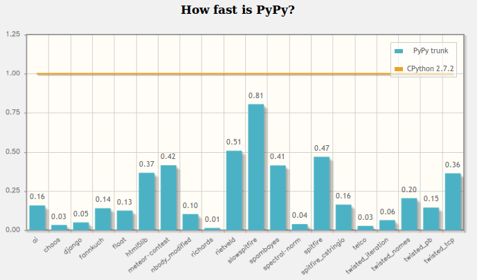

.. include:: beamerdefs.txt

==========================
Python & PyPy performance
==========================

About us
---------

- PyPy core devs

- ``vmprof``, ``cffi``, ``pdb++``, ``fancycompleter``, ...

- Consultants

- http://baroquesoftware.com/

About you
-------------

- You are proficient in Python

- Your Python program is slow

- You want to make it fast(er)

Optimization for dummies
-------------------------

* Obligatory citation

  - *premature optimization is the root of all evil* (D. Knuth)

* Pareto principle, or 80-20 rule

  - 80% of the time will be spent in 20% of the program

  - 20% of 1 mln is 200 000

* Two golden rules:

  1. Identify the slow spots

  2. Optimize them

This talk
----------------------------

* Two parts

  1. How to identify the slow spots

  2. How to address the problems

Part 1
-------

* profiling

* tools

What is performance?
--------------------

* you need something quantifiable by numbers

* usually, time spent doing task X

* sometimes number of requests, latency, etc.

* some statistical properties about that metric (average, minimum, maximum)

Do you have a performance problem?
----------------------------------

* define what you're trying to measure

* measure it (production, benchmarks, etc.)

* see if Python is the cause here (if it's not, we can't help you,
  but I'm sure someone can)

* make sure you can change and test stuff quickly (e.g. benchmarks are better
  than changing stuff in production)

* same as for debugging

We have a python problem
------------------------

* tools, timers etc.

* systems are too complicated to **guess** which will be faster

* find your bottlenecks

* 20/80 (but 20% of million lines is 200 000 lines, remember that)

Profilers landscape
-------------------

* cProfile, runSnakeRun (high overhead) - event based profiler

* plop, vmprof - statistical profiler

* cProfile & vmprof work on pypy

vmprof
------

* inspired by ``gperftools``

* statistical profiler run by an interrupt (~300Hz on modern linux)

* sampling the C stack

* CPython, PyPy, possibly more virtual machines

why not just use gperftools?
----------------------------

* C stack does not contain python-level frames

* 90% ``PyEval_EvalFrame`` and other internals

* we want python-level functions

* picture is even more confusing in the presence of the JIT

using vmprof
------------

* demo

* http://vmprof.readthedocs.org

using vmprof in production
--------------------------

* low overhead (5-10%), possibly lower in the future

* possibility of realtime monitoring (coming)

vmprof future
-------------

* profiler as a service

* realtime advanced visualization

Part 2
------

Make it fast

Tools
------

- Endless list of tools/techniques to increment speed

- C extension

- Cython

- numba

- "performance tricks"

- **PyPy**

  * We'll concentrate on it

  * WARNING: we wrote it, we are biased :)

  * gives you most wins for free (*)

What is PyPy
---------------

- Alternative, fast Python implementation

- Performance: JIT compiler, advanced GC

- PyPy 2.6.0 (Python version 2.7.9)

- Py3k as usual in progress (3.2.5 out, 3.3 in development)

- http://pypy.org

- EP Talks:
  
  * The GIL is dead: PyPy-STM
    
    (July 23, 16:45 by Armin Rigo)

  * PyPy ecosystem: CFFI, numpy, scipy, etc 
    
    (July 24, 15:15 by Romain Guillebert)

Speed: 7x faster than CPython
-------------------------------

The JIT
--------

.. image:: jit-overview1.pdf
   :scale: 50%

The JIT
--------

.. image:: jit-overview2.pdf
   :scale: 50%

The JIT
--------

.. image:: jit-overview3.pdf
   :scale: 50%

JIT overview
-------------

- Tracing JIT

  * detect and compile "hot" code

- **Specialization**

- Precompute as much as possible

- Constant propagation

- Aggressive inlining

Specialization (1)
-------------------

- ``obj.foo()``

- which code is executed? (SIMPLIFIED)

  * lookup ``foo`` in obj.__dict__

  * lookup ``foo`` in obj.__class__

  * lookup ``foo`` in obj.__bases__[0], etc.

  * finally, execute ``foo``

- without JIT, you need to do these steps again and again

- Precompute the lookup?

Specialization (2)
--------------------

- pretend and assume that ``obj.__class__`` IS constant

  * "promotion"

- guard

  * check our assumption: if it's false, bail out

- now we can directly jump to ``foo`` code

  * ...unless ``foo`` is in ``obj.__dict__``: GUARD!

  * ...unless ``foo.__class__.__dict__`` changed: GUARD!

- Too many guard failures?

  * Compile some more assembler!

- guards are cheap

  * out-of-line guards even more

Specialization (3)
---------------------

- who decides what to promote/specialize for?

  * we, the PyPy devs :)

  * heuristics

- instance attributes are never promoted

- class attributes are promoted by default (with some exceptions)

- module attributes (i.e., globals) as well

- bytecode constants

Specialization trade-offs
--------------------------

- Too much specialization

  * guards fails often

  * explosion of assembler

- Not enough specialization

  * inefficient code

Guidos points
-------------

xzxzcxzcxz

Don't do it on PyPy (or at all)
-------------------------------

yyyy

More about PyPy
---------------

* we are going to run a PyPy open space

* come ask more questions

Q&A?
----

* Thank you!

* http://baroquesoftware.com

* http://pypy.org

* http://vmprof.readthedocs.org
