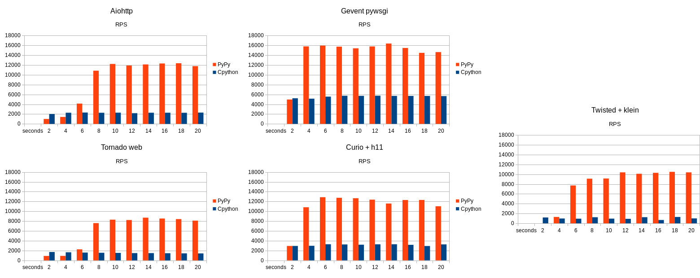

===========================================================
PyPy meets Python 3 and Numpy (and other What's New topics)
===========================================================

What's New In PyPy
==================

1. Python 3.5

2. Numpy, Cython, Pandas, ...

3. pypy-stm?

4. RevDB: reverse debugging

5. Others...

What is PyPy
============

* PyPy is another implementation of Python

* Mostly, drop-in replacement

* Supports Python 2.7, and almost Python 3.5

* Comes with a JIT, good performance

PyPy 3.5
============================================================

PyPy 3.5
==========

* Python 3.5 support released in *gamma*

  - as stable (and mostly as fast) as PyPy 2.7, same JIT/GC/etc.

  - what could be wrong is a few details everywhere

  - please try it and *report issues!*

* Thanks to Mozilla for funding this work!

PyPy 3.5
==========

* Async HTTP benchmarks:

PyPy 3.5 status
===============

* Roughly complete 3.5 support (plus f-strings!)

* Reasonably good performance

* Tested mostly on Linux so far

* First "final" to be released soon (i.e. some time in 2017 I guess)

* Python 3.6 to follow

Scientific stack
============================================================

Scientific stack
================

Numpy or Numpypy?

* Numpy = the standard numpy library

* Numpypy = our own partial reimplementation

Scientific stack
================

Numpy or Numpypy?

* Numpy = the standard numpy library  *(use this)*

* Numpypy = our own partial reimplementation  *(deprecated)*

Scientific stack
================

* Numpy works (99.9%)

* On both PyPy 2.7 and PyPy 3.5

* The rest of the scientific stack mostly works too (Jupyter,
  Matplotlib, Pandas, etc.)

Cython, cpyext
================

* Cython mostly works

* Actually, any CPython C extension module mostly works

* Thanks to ``cpyext``, our CPython C API emulation layer

Performance?
==============

* Numpy/Pandas/etc. are all slow-ish at the Python-C boundary

* Less so than last year but still

* Complex algorithms written inside Numpy in C or Fortran have the same
  speed, of course

  - lots of ``ndarray[index]``: slow

  - one call to ``numpy.linalg.eig()``: fast

  - speed hack: ``p = ffi.cast("double *", ffi.from_buffer(ndarray))``

Performance?
==============

* We have plans to improve

* Funding help welcome

* For now: try it out on your own code and see

Software Transactional Memory
============================================================

Software Transactional Memory
=============================

* ``pypy-stm``: getting rid of the Global Interpreter Lock

Software Transactional Memory
=============================

* ...unfortunately, this approach does not seem to work :-(

Software Transactional Memory
=============================

Unstable performance:

* "Conflicts" between threads are hard to find

* Fix one conflict, usually only to uncover the next one

* As long as there is one, performance is bad

* You may fix enough to get good performance... but:

* Continue developing the program, and you'll often reintroduce conflicts

* (Also, hard to test for, reliably)

PyPy-nogil?
===========

* Thinking instead about a GIL-free but non-STM PyPy

* See lightning talk later

Reverse Debugger
============================================================

Reverse Debugger
================

* RevDB: The essential tool you need once a year

Reverse Debugger
================

* Debugger with the ability to go forward *and backward in time*

* Watchpoints to know when a value changes, while going in either
  direction

* http://bitbucket.org/pypy/revdb

Others
============================================================

JIT improvements
======================

* Reductions in the warm-up time

* Consumes less memory, too

VMProf
=====================

* A good high-performance profiler for Python code

* ``pip install vmprof``

* Works on CPython and on PyPy

* The PyPy version shows the machine code generated by the JIT

CFFI improvements
=======================

* CFFI: calling C from Python or the other way around

* Works identically on CPython and on PyPy

* Biggest improvement of last year is *embedding*

* Use CFFI to embed Python inside another program---much easier than
  with the CPython C API, and works identically on CPython or PyPy too

Next year?
=================================================================

Next year?
==========

* Polish PyPy 3.5 / 3.6

* Polish Numpy and the scientific stack

* Play with PyPy-nogil

* Port RevDB to PyPy 3.5

.

Question & answers
==================

* Polish PyPy 3.5 / 3.6

* Polish Numpy and the scientific stack

* Play with PyPy-nogil

* Port RevDB to PyPy 3.5

Thank you!  PyPy main site: http://pypy.org/
