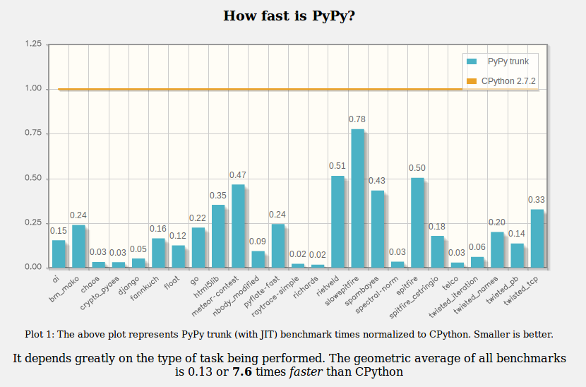

.. include:: beamerdefs.txt

==========================================
The joy of PyPy JIT: abstractions for free
==========================================

About me
---------

- PyPy core dev

- ``pdb++``, ``cffi``, ``vmprof``, ``capnpy``, ...

- @antocuni

- http://antocuni.eu

General question
----------------

Q: "How fast is PyPy?"

|pause|

A: "It depends"

speed.pypy.org
---------------

           

The joy of PyPy
----------------

- No single "speedup" factor

- The better the code, the greater the speedup

           
Good code
---------

- Correct

- Readable

- Easy to maintain

- Nice APIs

- Fast

Abstractions
------------

- functions

- classes

- inheritance

- etc.

- PRO: readability

|pause|

- CON: **cost of abstraction?**

  
Example: Sobel filter
----------------------

Edge detection
|br|
   
.. image:: sobel.png
       :scale: 40%

Image
-----

- greyscale

- ``w, h, data``

- ``data = array.array('B')`` of ``w * h`` bytes

- pixel ``(x, y)`` at index ``x + w*y``

Version 0
---------

|scriptsize|

.. sourcecode:: python

    def sobel(img):
        w, h, data = img
        data_out = array.array('B', [0]) * (w*h)
        out = w, h, data_out
        for y in xrange(1, h-1):
            for x in xrange(1, w-1):
                dx = (-1.0 * data[(x-1) + w*(y-1)] +
                       1.0 * data[(x+1) + w*(y-1)] +
                      -2.0 * data[(x-1) + w*y    ] +
                       2.0 * data[(x+1) + w*y    ] +
                      -1.0 * data[(x-1) + w*(y+1)] +
                       1.0 * data[(x+1) + w*(y+1)])
 
                dy = (-1.0 * data[(x-1) + w*(y-1)] +
                      -2.0 * data[x     + w*(y-1)] +
                      -1.0 * data[(x+1) + w*(y-1)] +
                       1.0 * data[(x-1) + w*(y+1)] +
                       2.0 * data[x     + w*(y+1)] +
                       1.0 * data[(x+1) + w*(y+1)])
 
                value = min(int(sqrt(dx*dx + dy*dy) / 2.0), 255)
                data_out[x + w*y] = value
        return out
 
|end_scriptsize|

Version 0
---------------

Demo

Version 0
----------

|column1|

.. image:: sobel/CPython-v0.png
   :scale: 30%
           
|column2|

.. image:: sobel/PyPy-v0.png
   :scale: 30%
           
|end_columns|

* PyPy is ~59x faster

Version 1
---------

|scriptsize|

.. sourcecode:: python

    def get(img, x, y):
        w, h, data = img
        i = x + y*w
        return data[i]

    def set(img, x, y, value):
        w, h, data = img
        i = x + y*w
        data[i] = value

    def sobel(img):
        w, h, data = img
        out = w, h, array.array('B', [0]) * (w*h)
        for y in xrange(1, h-1):
            for x in xrange(1, w-1):
                dx = (-1.0 * get(img, x-1, y-1) +
                       1.0 * get(img, x+1, y-1) +
                      -2.0 * get(img, x-1, y)   +
                       2.0 * get(img, x+1, y)   +
                      -1.0 * get(img, x-1, y+1) +
                       1.0 * get(img, x+1, y+1))
                dy = ...
        ...

|end_scriptsize|

Version 1
----------

|column1|

.. image:: sobel/CPython-v1.png
   :scale: 30%
           
|column2|

.. image:: sobel/PyPy-v1.png
   :scale: 30%
           
|end_columns|

* PyPy is ~97x faster

Version 2
---------

|scriptsize|

.. sourcecode:: python

    class Image(object):

        def __init__(self, width, height, data=None):
            self.width = width
            self.height = height
            if data is None:
                self.data = array.array('B', [0]) * (width*height)
            else:
                self.data = data

        def __getitem__(self, idx):
            x, y = idx
            return self.data[x + y*self.width]

        def __setitem__(self, idx, value):
            x, y = idx
            self.data[x + y*self.width] = value

|end_scriptsize|

Version 2
----------

|column1|

.. image:: sobel/CPython-v2.png
   :scale: 30%
           
|column2|

.. image:: sobel/PyPy-v2.png
   :scale: 30%
           
|end_columns|

* PyPy is ~170x faster

Version 3
-------------

|scriptsize|

.. sourcecode:: python

    _Point = namedtuple('_Point', ['x', 'y'])
    class Point(_Point):
        def __add__(self, other):
            ox, oy = other
            x = self.x + ox
            y = self.y + oy
            return self.__class__(x, y)

    class ImageIter(object):
        def __init__(self, x0, x1, y0, y1):
            self.it = itertools.product(xrange(x0, x1), xrange(y0, y1))
        def __iter__(self):
            return self
        def next(self):
            x, y = next(self.it)
            return Point(x, y)

    class Image(v2.Image):
        def noborder(self):
            return ImageIter(1, self.width-1, 1, self.height-1)

|end_scriptsize|

Version 3
-------------

|scriptsize|

.. sourcecode:: python

    def sobel(img):
        img = Image(*img)
        out = Image(img.width, img.height)
        for p in img.noborder():
            dx = (-1.0 * img[p + (-1,-1)] +
                   1.0 * img[p + ( 1,-1)] + 
                  -2.0 * img[p + (-1, 0)] +
                   2.0 * img[p + ( 1, 0)] + 
                  -1.0 * img[p + (-1, 1)] +
                   1.0 * img[p + ( 1, 1)])

            dy = (-1.0 * img[p + (-1,-1)] +
                  -2.0 * img[p + ( 0,-1)] +
                  -1.0 * img[p + ( 1,-1)] + 
                   1.0 * img[p + (-1, 1)] +
                   2.0 * img[p + ( 0, 1)] +
                   1.0 * img[p + ( 1, 1)])

            value = min(int(sqrt(dx*dx + dy*dy) / 2.0), 255)
            out[p] = value

|end_scriptsize|

Version 3
----------

|column1|

.. image:: sobel/CPython-v3.png
   :scale: 30%
           
|column2|

.. image:: sobel/PyPy-v3.png
   :scale: 30%
           
|end_columns|

* PyPy is ~400x faster

The cost of abstraction
------------------------

* CPython

  - each version ~2-3x slower than the previous one

  - v3 is ~8.5x slower than v0

* PyPy

  - abstractions (almost) for free

  - v3 is ~20% slower than v0, v1, v2

PyPy JIT 101
-------------

* What is the JIT doing?

* Which code is optimized away?

  
Loops and guards
-----------------

|tiny|
|column1|

.. sourcecode:: python

    def compute(n):
        total = 0
        i = 0
        while i < n:
            total += i
            i += 1
        return total

|pause|        
|column2|

.. sourcecode:: python

    cdef loop0(i, n, total):
        assert isinstance(n, int)
        while True:
            assert i < n
            total = int_add_ovf(total, i)
            assert not_overflow(total)
            i = int_add_ovf(i, 1)
            assert not_overflow(i)
           
|end_columns|
|end_tiny|

Bridges (1)
-----------------

|tiny|
|column1|

.. sourcecode:: python

    def compute(n):
        total = 0
        i = 0
        while i < n:
            if i % 2:
                total += i
            else:
                total += (i-5)
            i += 1
        return total

|pause|
|column2|

.. sourcecode:: python

    cdef loop0(i, n, total):
        assert isinstance(n, int)
        while True:
            assert i < n
            assert i % 2 != 0
            total = int_add_ovf(total, i)
            assert not_overflow(total)
            i = int_add_ovf(i, 1)
            assert not_overflow(i)
                
|end_columns|
|end_tiny|

Bridges (2)
-----------------

|tiny|
|column1|

.. sourcecode:: python

    def compute(n):
        total = 0
        i = 0
        while i < n:
            if i % 2:
                total += i
            else:
                total += (i-5)
            i += 1
        return total

|column2|

.. sourcecode:: python

    cdef loop0(i, n, total):
        assert isinstance(n, int)
        while True:
            assert i < n
            if i % 2 != 0:
                total = int_add_ovf(total, i)
                assert not_overflow(total)
                i = int_add_ovf(i, 1)
                assert not_overflow(i)
            else:
                tmp = int_sub_ovf(i, 5)
                assert not_overflow(tmp)
                total = int_add_ovf(total, tmp)
                i = int_add_ovf(i, 1)
                assert not_overflow(i)
                
|end_columns|
|end_tiny|

Inlining
-----------------

|tiny|
|column1|

.. sourcecode:: python

    def fn(a, b):
        return a + b
                
    def compute(n):
        total = 0
        i = 0
        while i < n:
            total = fn(total, i)
            i += 1
        return total

|column2|

.. sourcecode:: python

    assert version(globals()) == 42
    assert id(fn.__code__) == 0x1234
    #
    assert isinstance(n, int)
    while True:
        assert i < n
        total = int_add_ovf(total, i)  # inlined!
        assert not_overflow(total)
        i = int_add_ovf(i, 1)
        assert not_overflow(i)
           
|end_columns|
|end_tiny|

Classes
-----------------

|tiny|
|column1|

.. sourcecode:: python

    import math
    class Point(object):
        def __init__(self, x, y):
            self.x = x
            self.y = y

        def distance(self):
            return math.hypot(self.x, self.y)
            
    def compute(points):
        total = 0
        for p in points:
            total += p.distance()
        return total

|column2|

.. sourcecode:: python

    cdef loop0(total, list_iter):
        assert version(globals()) == 42
        assert version(math.__dict__) == 23
        assert version(Point.__dict__) == 56
        assert id(Point.distance.__globals__) == 0x1234
        assert version(Point.distance.__globals__) == 78
        assert id(Point.distance.__code__) == 0x5678

        while True:
            p = next(list_iter)
            assert isinstance(p, Point)
            # <inlined Point.distance>
            assert isinstance(p.x, float)
            assert isinstance(p.y, float)
            p_x = p.x
            p_y = p.y
            tmp = c_call(math.hypot, p_x, p_y)
            # </inlined>
            total = float_add(total, tmp)
           
|end_columns|
|end_tiny|

Virtuals
-----------------

|tiny|
|column1|

.. sourcecode:: python
            
    def compute(n):
        total = 0.0
        i = 0.0
        while i < n:
            p = Point(i, i+1)
            total += p.distance()
            i += 1
        return total

|pause|
|column2|

.. sourcecode:: python

    assert ...
    assert isinstance(n, int)
    assert isinstance(i, float)
    while True:
        assert i < n
        # Point() is "virtualized" into p_x and p_y
        p_x = i
        p_y = float_add(i, 1.0)
        #
        # inlined call to Point.hypot
        tmp = c_call(math.hypot, p_x, p_y)
        total = float_add(total, tmp)
           
|end_columns|
|end_tiny|

More PyPy at EuroPython
------------------------

* PyPy Help Desk

  - Tomorrow, 10:30-12:00 and 14:00-15:30

  - Come and ask us questions!

* "PyPy meets Python 3 and numpy"

   - Armin Rigo

   - Friday, 14:00

* Or, just talk to us :)

