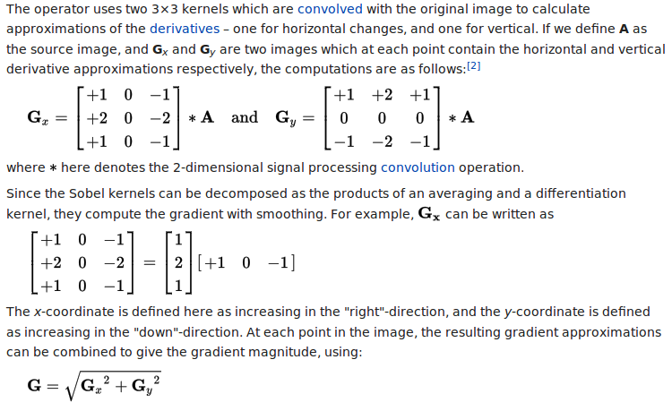

.. include:: beamerdefs.txt

==========================================
The joy of PyPy JIT: abstractions for free
==========================================

About me
---------

- PyPy core dev

- ``pdb++``, ``cffi``, ``vmprof``, ``capnpy``, ...

- @antocuni

- http://antocuni.eu

General question
----------------

Q: "How fast is PyPy?"

|pause|

A: "It depends"

speed.pypy.org
---------------

.. image:: speed.png
   :scale: 40%
           

The joy of PyPy
----------------

- No single "speedup" factor

- The better the code, the greater the speedup

           
Good code
---------

- Correct

- Readable

- Easy to maintain

- Nice APIs

- Fast

Abstractions
------------

- functions

- classes

- inheritance

- etc.

- PRO: readability
  
- CON: speed?

  
Example: Sobel filter
----------------------

Edge detection
|br|
   

Image
-----

- greyscale

- `w`, `h`

- `array.array('B')` of `w * h` bytes

- pixel `(x, y)` at index `x + w*y`

Version 0
---------

|scriptsize|

.. sourcecode:: python

    def sobel(img):
        w, h, data = img
        data_out = array.array('B', [0]) * (w*h)
        out = w, h, data_out
        for y in xrange(1, h-1):
            for x in xrange(1, w-1):
                dx = (-1.0 * data[(x-1) + w*(y-1)] +
                       1.0 * data[(x+1) + w*(y-1)] +
                      -2.0 * data[(x-1) + w*y    ] +
                       2.0 * data[(x+1) + w*y    ] +
                      -1.0 * data[(x-1) + w*(y+1)] +
                       1.0 * data[(x+1) + w*(y+1)])
 
                dy = (-1.0 * data[(x-1) + w*(y-1)] +
                      -2.0 * data[x     + w*(y-1)] +
                      -1.0 * data[(x+1) + w*(y-1)] +
                       1.0 * data[(x-1) + w*(y+1)] +
                       2.0 * data[x     + w*(y+1)] +
                       1.0 * data[(x+1) + w*(y+1)])
 
                value = min(int(sqrt(dx*dx + dy*dy) / 2.0), 255)
                data_out[x + w*y] = value
        return out
 
|end_scriptsize|

