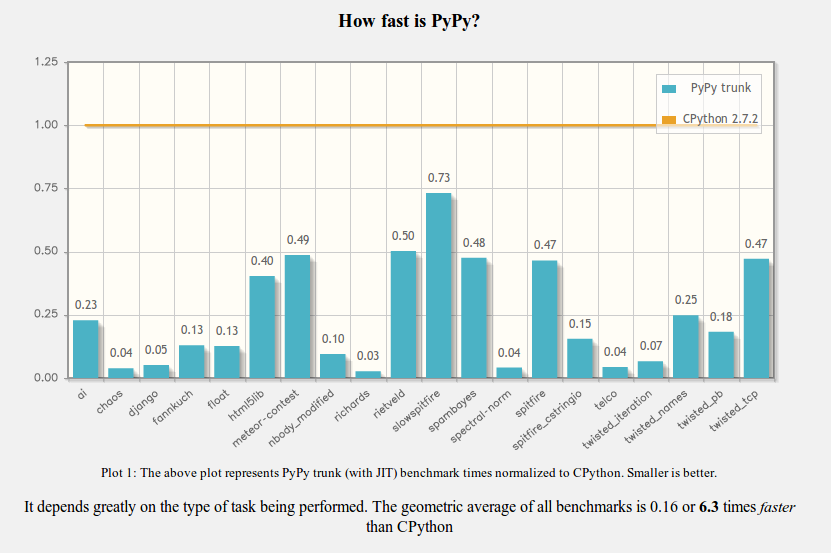

=================================
How PyPy makes your code run fast
=================================

Introduction
============

* Romain Guillebert, @rguillebert

* PyPy contributor for ~3 years

* NumPyPy contributor

* Please interrupt me

* How the PyPy JIT works (kind of)

* Warning : May contain traces of machine code

speed.pypy.org
==============

AOT
===

* Ahead of time compilation

* GCC

* You can optimize only on what you know before running the program

Interpreter
===========

* CPython, PyPy

* Do everything at runtime

* Not very smart

JIT
===

* PyPy

* Gathers information at runtime

* Produces optimized machine code

Tracing JIT
===========

* Optimizes loops

* Traces one iteration of a loop

* Produces a linear trace of execution

* The trace is then optimized and compiled

Guard
=====

* The JIT produces a linear trace, but the code isn't

* The JIT can make assumptions that are not always true

* Guard : If this is true, continue, otherwise return to the interpreter

* guard_true, guard_class, guard_no_exception, ...

Bridge
======

* After a guard has failed X times, the other path is traced, compiled and attached to the trace

Jitviewer
=========

* Jitviewer demo

Demo
====

* Edge detection algorithm

Questions
=========

* Questions ?
