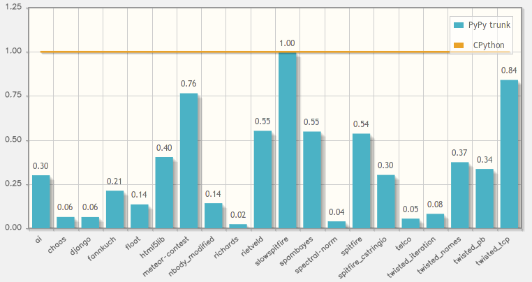
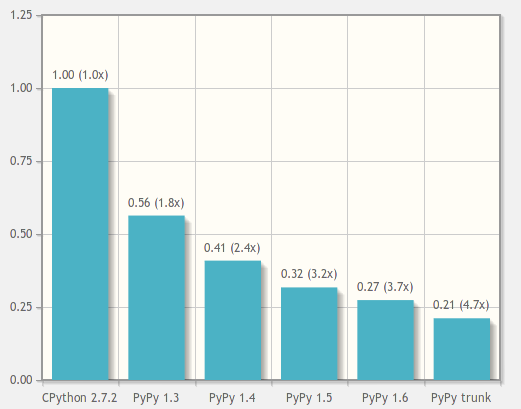
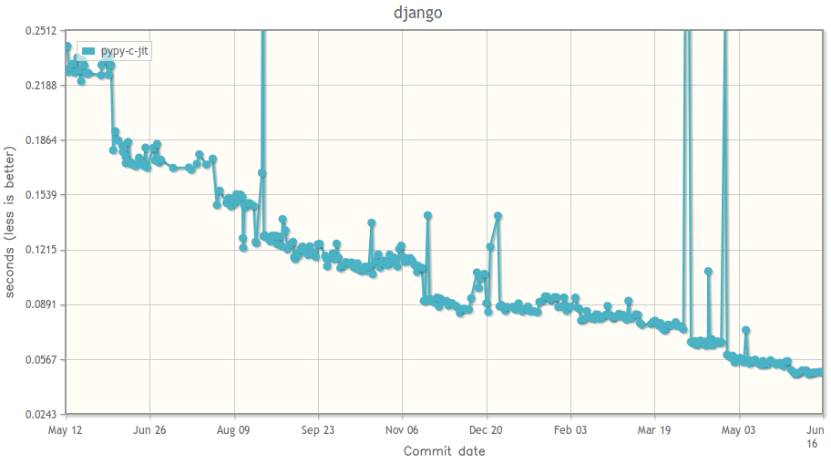

.. include:: beamerdefs.txt

==============================================
                     PyPy
==============================================

PyPy
--------

Speed
---------

Speed
---------

Speed
------------------------------

What is PyPy
---------------------------

PyPy

- started in 2003

- partially publically funded

- Open Source

What is PyPy
---------------------------

PyPy

- Python implementation

- framework for fast dynamic languages

Framework for fast dynamic languages
-------------------------------------------

* It is easy to implement a new language with PyPy

* Suited for *dynamic* languages (preferrably)

|pause|

* Java or .NET?  Not really suited

For the language implementor
--------------------------------

* Pick your favourite (dynamic) language

|pause|

* Write an interpreter for it

|pause|

* ...in RPython, a subset of Python

|pause|

* ...ignoring all hard issues:

  - the object model

  - garbage collection

  - coroutines

  - Just-in-Time Compilation

Just-in-Time Compilation
------------------------

!?

Just-in-Time Compilation
------------------------

"It works" in practice:

* PyPy the Python interpreter is fast

* Pyrolog, a Prolog interpreter, is fast too

* Haskell, GameBoy, ...

|pause|

* ...and yours :-)

Just-in-Time Compilation
------------------------

* Tracing JIT Compiler

* Not unlike TraceMonkey for JavaScript in Firefox

* But two levels

* Really traces the RPython interpreter, which runs the application

PyPy 1.7
---------

* Release soon (last release, 1.6, this summer)

* Python 2.7.x

* The most compatible alternative to CPython

* Most programs just work

* C extensions might not work (or might work)

|pause|

* ...fast

|pause|

* ...can use less memory, but usually not

  - ``__slots__`` on CPython, not needed on PyPy

PyPy's future?
--------------------

.. sourcecode:: plain

   CPython 2.7   ------->   CPython 3.x

        ^                        ^
        |                        |
        |                        |
        |                        |
        V                        V

     PyPy 1.x    <------>    PyPy3 1.x

PyPy's future?
--------------------

.. sourcecode:: plain

   CPython 2.7   ------->   CPython 3.x
   ~~~~~~~~~~~~~~~~~~~~~~~~~~~~~~~~~~~~
        ^      written in C      ^
        |                        |
        |                        |
        |                        |
        V                        V

     PyPy 1.x    <------>    PyPy3 1.x

PyPy's future?
--------------------

.. sourcecode:: plain

   CPython 2.7   ------->   CPython 3.x

        ^                        ^
        |                        |
        |                        |
        |       written in       |
        V      Python 2.5-7      V
     ~~~~~~~~~~~~~~~~~~~~~~~~~~~~~~~~~
     PyPy 1.x    <------>    PyPy3 1.x

Contacts, Q/A
--------------

- http://pypy.org

- blog: http://morepypy.blogspot.com

- mailing list: ``pypy-dev@python.org``

- IRC: #pypy on freenode

Questions

.. image:: question-mark.png
   :scale: 10%
   :align: center
