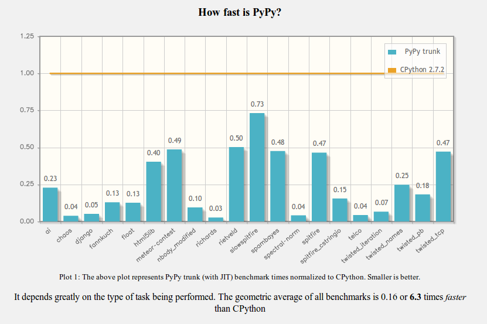
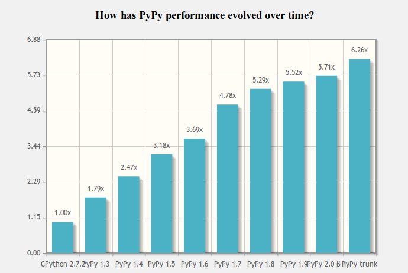

.. include:: beamerdefs.txt

================================================
PyPy : l'implémentation la plus rapide de Python
================================================

Terminologie
------------

* Python

* CPython

* PyPy

* RPython

Introduction
------------

* PyPy est un interpreteur Python écrit en RPython qui vise à être le plus rapide possible

* Vise à exécuter n'importe quel code Python

RPython
-------

* Langage/Framework pour écrire des machines virtuelles

* Sous-ensemble de Python

* Vivement déconseillé pour d'autres usages

|pause|

* Ajoute (quasi) automatiquement un compilateur juste-a-temps et un ramasse miette (stop-the-world ou incrémental)

* Nombreux langages (plus ou moins) implémentés avec ce Framework : Python (PyPy), Ruby (Topaz), PHP(Hippy), Scheme, Smalltalk, Emulateur GameBoy, Brainfuck

PyPy
----

* Vieux de plus de 10 ans

* Créer par (entre autres) Armin Rigo comme un remplaçant de psyco

* Supporte x86, x86_64, ARM

* Supporte Linux, Mac OS X, et Windows 32 bits

* Production ready™

speed.pypy.org
--------------

speed.pypy.org
--------------

Demo
----

* `sobel.py`

JIT
---

* Optimise les boucles et les fonctions recursives

* Meta-Tracing JIT

* Trace une boucle à la 1039ième itération

* Inline presque tout

* Compile un seul chemin a la fois

Compatibilité
-------------

* 100% compatible avec la spécification du langage

* Attention aux destructeurs (fermez vos fichiers)

* Support des extensions C en version béta, performances médiocres

Futur
-----

* STM

* Numpy

* Python 3

* Appel aux dons sur ces 3 projets : pypy.org

Numpy
-----

* Réécriture du code C en RPython (jit-friendly)

* Réutilisation du code Python

|pause|

* Compatibilité

* Vitesse

Demo de Numpy
-------------

* Demo ndarray() + ndarray() VS itération

Questions ?
-----------

Questions ?
