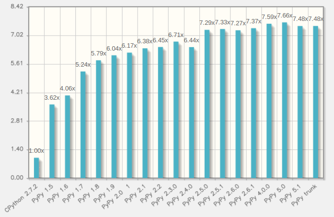

.. include:: beamerdefs.txt

=========
PyPy 2016
=========

Introduction
------------

Python is

* A syntax or two

* An interpreter

* A set of standard libraries shipped with the interpreter

* A vibrant number of communitis that shares code

PyPy
----

* PyPy is an interpreter written in RPython

* Speed is one of its main advantages

* Compatible (mostly)

Speed
-----

How ?
-----

* Tracing Just-In-Time compiler

* Optimizes loops

* Traces one iteration of a loop

* Produces a linear trace of execution

* Inlines almost everything

* The trace is then optimized and compiled

* Removes overhead

Prove It
--------

Techniques to achieve performant Python
---------------------------------------

* Write better code
  
  - string concatenation

  - attribute lookup

* Rewrite your code in C

* Rewrite your code in Cython

* Add accelators like Numba

* Use PyPy

Why not PyPy?
-------------

* Python III

* Third-party library support

PyPy and C (1/2)
----------------

* PyPy and CFFI

* CFFI is the easiest tool to I've used so far

* Very fast on PyPy, fast enough on CPython

* Used by NumPyPy

* Use CFFI to call python from C 

  - This means you can create your own C API in pure Python !

PyPy and C (2/2)
----------------

* CFFI enables embedded Python (and PyPy) in a C application (uWSGI)

* What about C-API (glad you asked)

* Actively worked on right now

Python C API
------------

* Leaks way too many implementation details (refcounting, PyObject structure fields)

* Makes it hard to improve Python while supporting 100% of the API

* PyPy 5.0 introduced a major rewrite

* Hint - good things are coming

NumPyPy
-------

* https://bitbucket.org/pypy/numpy + pypy

* I have been working on it since 2011

* Replaces ndarray, umath with builtin modules

* ~85% of the numpy tests are passing, on all platforms

* Most of numpy is there: object dtypes, ufuncs

* linalg, fft, random all via cffi

NumPyPy performance
-------------------

* Should be as fast as Numpy, faster for smaller arrays

* Lazy evaluation ?

* But what about SciPy?

PyMetabiosis
------------

* https://github.com/rguillebert/pymetabiosis

* Work in progress

* Allows you to use any CPython module on PyPy (scipy for example)

* Embeds CPython into PyPy with CFFI

* Numpy arrays can be shared between PyPy and CPython

PyMetabiosis
------------

|scriptsize|

.. sourcecode:: python

    from pymetabiosis import import_module

    cpython_virtualenv_path = 
        "/tmp/venv/bin/activate_this.py"

    builtin = import_module("__builtin__")

    # Activate a virtualenv for the cpython interpreter
    builtin.execfile(cpython_virtualenv_path,
        {"__file__" : cpython_virtualenv_path}
    )

    pylab = import_module("matplotlib.pylab")

    pylab.plot([1, 2, 3, 4])
    pylab.show()

|end_scriptsize|

JitPy
-----

* http://jitpy.readthedocs.io

* Proof of concept (Maciej Fijałkowski)

* Embeds PyPy into CPython

* Provides a decorator that allows you to run specific functions on PyPy

* Is used the same way as numba, but different performance characteristics

JitPy
-----

|scriptsize|

.. sourcecode:: python

    import numpy as np
    from jitpy import setup
    setup('<path-to-pypy-home>')
    from jitpy.wrapper import jittify

    @jittify(['array', float], float)
    def f(a, s):
        r = 0
        for i in xrange(a.shape[0]):
            r += a[i] * s
    return s
    func(np.arange(10000), 1.2)

|end_scriptsize|

Future - wouldn't it be great if
--------------------------------

* Improved C extension compatibility

* Native Numpy + Scipy + ...

The Future is Now!
------------------

* (Applause)

* Native numpy (tweaked) passes 90% of tests

* How to leverage the JIT?

Why this makes sense
--------------------

* Advantages and disadvantages of RPython

* Advantages of a JIT (vectorization)

* Leveraging this for other dynamic languages

Takeaway
--------

* Get PyPy at pypy.org (or from your favorite distribution)

* Try it

* Give us feedback (good or bad)

Thank You
---------

Questions ?
