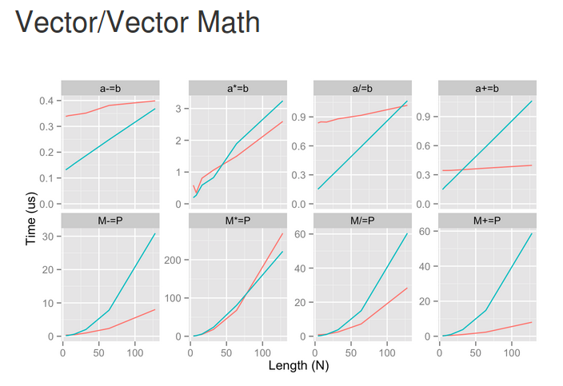

.. include:: beamerdefs.txt

=========
PyPy 2016
=========

Python means four things:
-------------------------

Python is

* A syntax or six `(2 * 3 = 6)`

* An interpreter to run code written in the syntax

* A set of standard libraries shipped with the interpreter

* A vibrant number of communities that share code

Techniques to achieve performant Python
---------------------------------------

* Write better code
  
  - string concatenation

  - attribute lookup

* Rewrite your code in C

* Rewrite your code in Cython

* Add accelators like Numba

* Use PyPy

PyPy
----

* PyPy is an interpreter written in RPython

* It ships with the standard library

* Speed is one of its main advantages

* Compatible (mostly) via pip install

* Not the only alternative interpreter

Speed (Applause)
----------------

Speed continued
---------------

* Benchmarking, statistics, politics

* Did I mention warmup time?

How ?
-----

* Tracing Just-In-Time compiler

* Optimizes loops

* Traces one iteration of a loop

* Produces a linear trace of execution

* The trace is then **optimized** and compiled

Why is this fast?
-----------------

* Inlining

* Promotion

* Unrolling

* Strategies

  - Convert sequences to arrays

  - Vectorization

Prove It
--------

* profiling

* jitviewer

Why not PyPy?
-------------

* Python and the community

* Third-party library support

* No easy packaging (like Winpython or Anaconda)

  - Opportunity???

PyPy and Third-party libraries
------------------------------

* PyPy and CFFI (Armin Rigo, Maciej Fijałkowski)

* CFFI is easy, just massage the headers and that's it

* Use CFFI to call python from C 

* CFFI enables embedded Python (and PyPy) in a C application (uWSGI)

* Very fast on PyPy, fast enough on CPython

PyPy and Third-party libraries
------------------------------

* Not everyone will rewrite in CFFI

* What about C-API (glad you asked)

* Actively worked on right now

Python C API
------------

* Leaks way too many implementation details (refcounting, PyObject structure fields)

* C allows you to cheat (private, read-only)

* Makes it hard to improve Python while supporting 100% of the API

* PyPy 5.0 introduced a major rewrite

* Hint - good things are coming

PyPy and Third-party libriaries: NumPyPy
----------------------------------------

* Numpy (and its ecosystem) is the last frontier for PyPy

* https://bitbucket.org/pypy/numpy + pypy

* I have been working on it since 2011, together with many others

* Replaces ndarray, umath with builtin modules

* ~85% of the numpy tests are passing, on all platforms

* Most of numpy is there: object dtypes, ufuncs

* linalg, fft, random all via cffi
* Should be as fast as Numpy, faster for smaller arrays

NumPyPy performance
-------------------

* From http://rpubs.com/mikefc/60129

* numpypy in blue, numpy in red

NumPyPy future
--------------

* Lazy evaluation ?

* But what about SciPy?

Future - wouldn't it be great if
--------------------------------

* Improved C extension compatibility

* Native Numpy + Scipy + ...

The Future is Now!
------------------

* Merged major upgrade of the C-API

* (Applause)

* Native numpy (tweaked) passes 90% of tests

* Download a nightly and try http://github.com/pypy/numpy

* How to leverage the JIT and NumPyPy?

Why this makes sense
--------------------

* Advantages of RPython

* Advantages of a JIT (vectorization)

* Leveraging this for other dynamic languages

Takeaway
--------

* Get PyPy at pypy.org (or from your favorite distribution)

* Use it in a virtualenv

* Give us feedback (good or bad) #pypy on IRC

Thank You 
---------

Questions ?  Examples:

* How can I get involved?

* What about commercial involvement?

* How can I get support?

* What about Python 3.5?

* What about this other interpreter I heard of?

