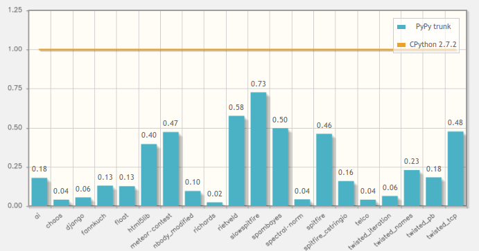

.. include:: beamerdefs.txt

================================
PyPy Status
================================

About me
---------

- PyPy core dev

- ``pdb++``, ``fancycompleter``, ...

- Consultant, trainer

- http://antocuni.eu

PyPy is not dead
----------------

- No PyPy status talk at EuroPython 2013

  * for the first time since 2004!

  * for no good reason :)

- PyPy is healthy and alive

What is PyPy?
--------------

* RPython toolchain

  - subset of Python

  - ideal for writing VMs

  - JIT & GC for free

* Python interpreter

  - written in RPython

  - **FAST**

* Whatever (dynamic) language you want

  - smalltalk, prolog, PHP, javascript, ...

PyPy: past two years (1)
-----------------------------

- PyPy 2.0 (May 2013)

  * beta ARM, CFFI, unicode performance

  * stackless + JIT (eventlet, gevent, ...)

|pause|

- PyPy 2.1 (July 2013)

  * stable ARM (thanks to Raspberry Pi foundation)

  * py3k (3.2.3), numpy, general improvements, bugfixes

|pause|

- PyPy 2.2 (November 2013)

  * incremental GC, faster JSON

  * more JIT, more py3k

  * more numpy, numpy C API

PyPy: past two years (2)
-------------------------

- PyPy 2.3 (May 2014)

- Lot of internal refactoring

- C API for embedding

  * pypy + uWSGI (thanks to Roberto De Ioris)

- the usual, boring, general improvements

More PyPy-powered languages
----------------------------

- RPython: general framework for dynamic languages

- Topaz: implementing Ruby

  * most of the language implemented, "definitely faster than MRI"

  * https://github.com/topazproject/topaz

- HippyVM: implementing PHP

  * http://hippyvm.com/

Current status
---------------

- Python code: "it just works"

- C code: better than ever!

  * cpyext: more complete, but still slow

  * CFFI: the future

  * Native PyPy C API for embedding

- Lots of CFFI modules around:

  * pygame_cffi, psycopg2_cffi, lxml

- numpy: in-progress, tons of code works out of the box

  * no scipy yet :-/

Speed: 6.3x faster than CPython
--------------------------------

Current status
---------------

- ARM

- CFFI

- numpy

- py3k

xxx
----

- future: STM

- Q&A
