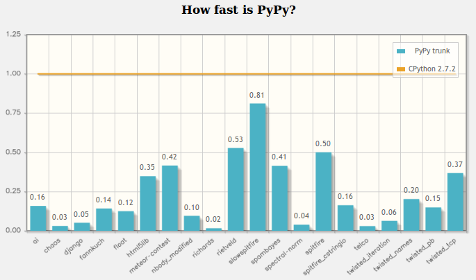

.. include:: beamerdefs.txt

================================
PyPy JIT (not) for dummies
================================

About me
---------

- PyPy core dev

- ``pdb++``, ``fancycompleter``, ...

- Consultant, trainer

- http://antocuni.eu

What is PyPy
---------------

- Alternative, fast Python implementation

- Performance: JIT compiler, advanced GC

- STM: goodbye GIL

- PyPy 2.5.1 (2.7.8)

- Py3k as usual in progress (3.2.5 out, 3.3 in development)

- http://pypy.org

STM
---

- pypy-stm-2.5.1 is out

  * 64 bit Linux only

- no GIL!

- 25-40% slowdown for single core programs

  * still ``7*0.75 = 5.25x`` faster than CPython :)

- parallelism up to 4 threads

- concurrency slow-but-correct by default

  * compared to fast-but-buggy by using threads

- conflict detection

- TransactionQueue: parallelize your program without using threads!

Extension modules
------------------

- CFFI: stable, mature and widely used

  * psycopg2cffi, lxml-cffi, pysdl2-cffi, etc.

  * should be used even for CPython-only projects!

- numpy:

  * support for linalg

  * support for pure Python, JIT friendly ufuncs

  * object dtype in-progress

- scipy: see next slide :)

Pymetabiosis
--------------

- embed CPython in PyPy

- import and use CPython modules in PyPy

- ALPHA status

- slow when passing arbitrary objects

- but fast for numpy arrays

- matplotlib and scipy works

- https://github.com/rguillebert/pymetabiosis

Speed: 7x faster than CPython
-------------------------------

The JIT
--------

.. image:: jit-overview1.pdf
   :scale: 50%

The JIT
--------

.. image:: jit-overview2.pdf
   :scale: 50%

The JIT
--------

.. image:: jit-overview3.pdf
   :scale: 50%
          

Contacts, Q&A
--------------

- http://pypy.org

- http://morepypy.blogspot.com/

- twitter: @antocuni

- Available for consultancy & training:

  * http://antocuni.eu

  * info@antocuni.eu

- Any question?

