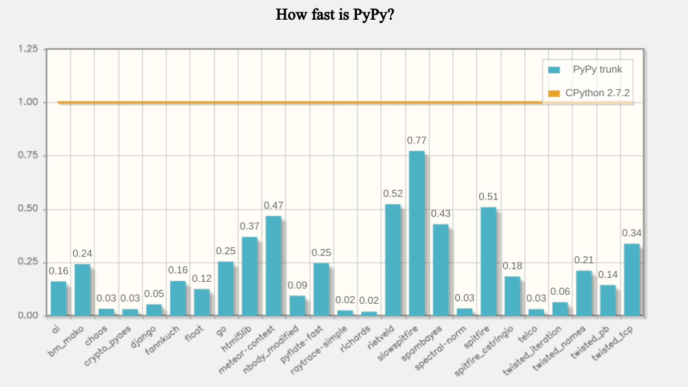
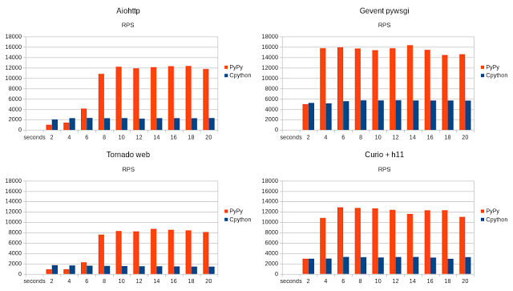

.. include:: beamerdefs.txt

================================
PyPy Status Update
================================

About me
---------

- PyPy core dev

- ``pdb++``, ``fancycompleter``, ``capnpy``, ...

- Consultant, trainer

- http://antocuni.eu

What is PyPy
---------------

- Alternative, fast Python implementation

- Performance: JIT compiler, advanced GC

- PyPy 5.7.1

  - x86, ARM, s390x, PPC

- http://pypy.org

Speed
-----

- 7.4 times *faster* than CPython

- http://speed.pypy.org

Usual questions
----------------

- **Is it stable/mature? Can I use it in production?**

- Does package X work?

- What about Python 3?

PyPy in the real world (1)
---------------------------

- High frequency trading platform for sports bets
  
  * low latency is a must

- PyPy used in production since 2012

- ~100 PyPy processes running 24/7

- up to 10x speedups

  * after careful tuning and optimizing for PyPy

PyPy in the real world (2)
---------------------------

.. image:: magnetic.png
   :scale: 23%
   :align: left

- Real-time online advertising auctions

  * tight latency requirement (<100ms)

  * high throughput (hundreds of thousands of requests per second)

- 30% speedup

|small|
|end_small|

    We run PyPy basically everywhere

    **Julian Berman**

  
PyPy in the real world (3)
--------------------------

- IoT on the cloud

- 5-10x faster

|small|
|end_small|

    We do not even run benchmarks on CPython because we just know that PyPy
    is way faster

    **Tobias Oberstein**

Usual questions
----------------

- Is it stable/mature? Can I use it in production? |ok|

- **Does package X work?**

- What about Python 3?

cpyext
------

- Pure Python pacakges just work (TM)

- C extensions goes through **cpyext**

- Lots of progresses in the compatibility area

- Still slow

  * Crossing the Python/C border takes ages

  * lots of low hanging fruits to be taken :)

- Use CFFI if possible

demo
----

live demo time :)
  
numpy
-----

- It just works

  * ~5 failing tests

- Better GC integration needed

- The GC does not know how much raw memory numpy objects are keeping alive
    
  * It **looks like** a memory leak

Other libs
-----------

- cython

  * it works

- pandas

  * ~95% of passing tests

  * most failures are because it cannot find Tkinter libs

  * We saw some segfaults

- scipy

  * ~99% of passing tests

  * Numpy memory leaks?

- matplotlib

  * Saving to disk works

  * Jupyter inline works

  * no GUI backends
    

Usual questions
----------------

- Is it stable/mature? Can I use it in production? |ok|

- Does package X work? |ok|

- **What about Python 3?**

PyPy 3.5
---------

- PyPy 5.7.1 supports Python 3.5 (beta)

- Funded by a big grant by Mozilla (thanks!)

  * |scriptsize| https://morepypy.blogspot.com/2016/08/pypy-gets-funding-from-mozilla-for.html |end_scriptsize|

- Still some failing tests

- Very good results on asyncio

  
PyPy 3.5 asyncio
----------------

- Between 2.87 and 8.08 times faster

Usual questions
----------------

- Is it stable/mature? Can I use it in production? |ok|

- Does package X work? |ok|

- What about Python 3? |ok|

- **Bonus topic: vmprof**

VMProf
------

- Statistical profiler

- Low overhead (~5%)

- For CPython and PyPy

- Distinguish between:

  - Interpreter

  - Native code

  - JIT (PyPy only)

  - GC (PyPy only)

    
VMProf example
--------------

::

   $ python -m vmprof --web foobar.py

   $ pypy -m vmprof --web foobar.py

   $ pypy -m vmprof --web --jitlog foobar.py

..
    CPython: http://vmprof.com/#/f7c45f78-fcb0-4c31-8fb5-d53546b94c09

    PyPy: http://vmprof.com/#/7d25c9ab-aeb8-495f-9e69-54bd2e242745
  
..
   Topics
   -----

   - STM / nogil branch :(

   - vmprof

   STM
   ---

   <arigato> we never really tried to fix all performance issues, and more importantly:
   <arigato> if you start with some multithreaded program, it is really slow
   <arigato> it's a bit depressing because you need to dig and fix conflicts, and not getting any speed-up at all, until with enough efforts suddenly it's fast
   <arigato> in other words, to make it usable we'd need something more flexible, probably based on much shorter transactions, but that needs rethoughts

