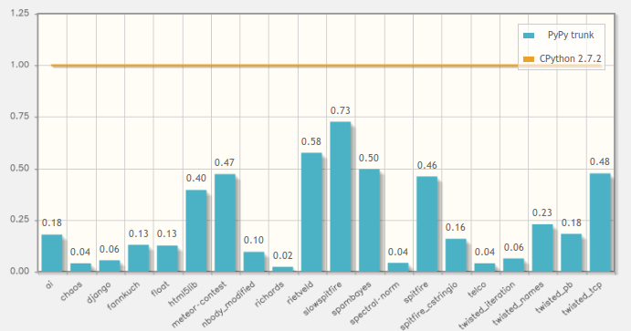

.. include:: beamerdefs.txt

===========================
XXXFAKETITLE
===========================

About me
---------

- PyPy core dev

- Working on HippyVM

What is PyPy?
--------------

- "PyPy is a fast, compliant alternative implementation of the Python language (2.7.8 and 3.2.5)."

- Python interpreter

  * written in RPython

  * **FAST**

What is RPython?
----------------

- Subset of Python

  * easy to read

  * easy to test

- JIT & GC for free

- General framework for dynamic languages

RPython-powered languages
-------------------------

- **PyPy**

|pause|

- HippyVM: implementing PHP

  * ~7x faster than standard PHP

  * http://hippyvm.com/

|pause|

- Topaz: implementing Ruby

  * https://github.com/topazproject/topaz

|pause|

- Pyrolog (Prolog)

- RTruffleSOM (Smalltalk)

- RSqueakVM (Smalltalk)

- lang-js (JavaScript)

RPython translation stages
--------------------------

- (R)Python code

|pause|

- ``import``

  * Python objects (functions, classes, ...)

|pause|

- Bytecode analysis, type inference

  * Typed control flow graph

|pause|

- Translator transformations

  * Add GC & JIT

|pause|

- Code generation

  * C code

|pause|

- ``gcc``

  * Compiled executable

How does the JIT work?
----------------------

|pause|

- "Jitcode": very low-level byte code

  * Translates to machine code

- Translation time

  * Add jitcode representation to RPython functions

- Run-time:

  * Detect **hot** loop

  * Trace one code path through the loop

  * Compile (magic!)
    
    - with guards to ensure correctness

  * Profit!

RPython example (HippyVM)
-------------------------

|scriptsize|

.. sourcecode:: python

    @wrap(['space', str, W_Root, Optional(int)])
    def strpos(space, haystack, w_needle, offset=0):
        """Find the position of the first occurrence of a substring in a string."""
        if offset < 0 or offset > len(haystack):
            space.ec.warn("strpos(): Offset not contained in string")
            return space.w_False
        try:
            needle = unwrap_needle(space, w_needle)
        except ValidationError as exc:
            space.ec.warn("strpos(): " + exc.msg)
            return space.w_False
        if len(needle) == 0:
            space.ec.warn("strpos(): Empty needle")
            return space.w_False

        result = haystack.find(needle, offset)

        if result == -1:
            return space.w_False
        return space.newint(result)

|end_scriptsize|

JITting strpos()
----------------

|example<| strpos_jit.php |>|

|scriptsize|

.. sourcecode:: php

  <?php
  function compute($n) {
      $sum = 0;
      for ($i=0; $i < 100000; $i++) {
          $sum += strpos($i, '1');
      }
      return $sum;
  }

  echo compute(100000) . "\n";
  ?>

|end_scriptsize|

|end_example|

JITting strpos()
----------------

|scriptsize|

.. parsed-literal::

  label(p0, p1, p3, p7, i48, i52, p33, p26, descr=TargetToken(140099127632144))
  i57 = int_eq(i52, 100000)
  guard_false(i57, descr=<Guard0x7f6b5ebd5a60>) [p1, p0, i52, p3, p7, i48]
  i58 = int_lt(i52, 100000)
  guard_true(i58, descr=<Guard0x7f6b5ebd59f0>) [p1, p0, p3, p7, i52, i48]
  guard_not_invalidated(descr=<Guard0x7f6b5ebd5980>) [p1, p0, p3, p7, p33, i52, i48]
  **p59 = call(ConstClass(ll_str__IntegerR_SignedConst_Signed), i52, descr=<Callr 8 i EF=3>)**
  guard_no_exception(descr=<Guard0x7f6b5ebd5910>) [p1, p0, p59, p3, p7, p33, i52, i48]
  i60 = strlen(p59)
  **i61 = call(ConstClass(ll_find_char__rpy_stringPtr_Char_Signed_Signed), p59, 49, 0, i60, descr=<Calli 8 riii EF=0>)**
  i62 = int_eq(i61, -1)
  guard_false(i62, descr=<Guard0x7f6b5ebd58a0>) [p1, p0, i61, p3, p7, p33, i52, i48]
  i63 = int_add_ovf(i48, i61)
  guard_no_overflow(descr=<Guard0x7f6b5ebd5830>) [p1, p0, i63, i61, i48, p3, p7, p33, i52, None]
  i64 = int_add(i52, 1)
  i65 = getfield_raw(24210432, descr=<FieldS pypysig_long_struct.c_value 0>)
  i66 = int_lt(i65, 0)
  guard_false(i66, descr=<Guard0x7f6b5ebd57c0>) [p1, p0, p3, p7, i63, i64, None, None, None]
  i67 = arraylen_gc(p26, descr=<ArrayU 1>)
  jump(p0, p1, p3, p7, i63, i64, p33, p26, descr=TargetToken(140099127632144))

|end_scriptsize|

PyPy: past two years (1)
-----------------------------

- PyPy 2.0 (May 2013)

  * Beta ARM, CFFI, unicode performance

  * stackless + JIT (eventlet, gevent, ...)

|pause|

- PyPy 2.1 (July 2013)

  * Stable ARM

  * py3k (3.2.3), numpy, general improvements, bugfixes

|pause|

- PyPy 2.2 (November 2013)

  * Incremental GC, faster JSON

  * More JIT, more py3k

  * More numpy, numpy C API

PyPy: past two years (2)
-------------------------

- PyPy 2.3 (May 2014)

  * Lot of internal refactoring

  * C API for embedding

  * General improvements

|pause|

- PyPy 2.4 (coming soon!)

  * Python 2.7.8 stdlib

  * General fixes and improvements 

Current status
---------------

- Python code: "it just works"

- 2.7: very stable

- 3.2: stable

  * Some missing optimizations

- 3.3: in-progress

Speed: 6.3x faster than CPython
--------------------------------

ARM
----

- Official support since PyPy 2.1

- "it just works"

- ~7.5x faster than CPython on ARM

- Thanks to Raspberry-Pi foundation

- Distributed as part of Raspbian OS

Compiled extensions
-------------------

- cpyext: incomplete, slow

- ctypes: inconvenient, slow

- "Don't write your own C, PyPy is fast enough"

|pause|

- Native PyPy C API for embedding

- CFFI: the future

- numpy: in-progress (more later)

CFFI
-----

- Python <-> C interfacing done right

  * Inspired by LuaJIT's FFI

  * existing shared libraries

  * custom C code

- Alternative to C-API, ctypes, Cython, etc.

- Fast on CPython, super-fast on PyPy

- Lots of CFFI modules around:

  * pygame_cffi, psycopg2_cffi, lxml, cryptography, pyzmq, ...

CFFI
--------------------

|example<| Simple example |>|
|scriptsize|

.. code:: python

    >>> from cffi import FFI
    >>> ffi = FFI()
    >>> ffi.cdef("""
    ...     int printf(const char *format, ...);   // from man page
    ... """)
    >>> C = ffi.dlopen(None)              # loads whole C namespace
    >>> arg = ffi.new("char[]", "world")  # char arg[] = "world";
    >>> C.printf("hi there, %s!\n", arg)  # call printf()
    hi there, world!

|end_scriptsize|
|end_example|

- Docs: http://cffi.readthedocs.org

numpy
-----

- In-progress

- ~80% of numpy implemented

  * 2415 passing tests out of 3265

- Just try it

- No scipy :-/

The future: STM
----------------

- Software Transactional Memory

- "Easier parallelism for everybody"

- On-going research project

  * by Armin Rigo and Remi Meier

Transactional Memory
--------------------

* like GIL, but instead of blocking, each thread runs optimistically

* "easy" to implement:

  - GIL acquire -> transaction start

  - GIL release -> transaction commit

* overhead: cross-checking conflicting memory reads and writes,
  and if necessary, cancel and restart transactions

Longer transactions
-------------------

- Larger atomic blocks

- threads and application-level locks still needed...

- but *can be very coarse:*

  - two transactions can optimistically run in parallel

  - even if they both *acquire and release the same lock*

- Can be hidden by libraries to provide even higher level paradigms

  * e.g.: Twisted apps made parallel out of the box

STM status
----------

- Preliminary versions of pypy-jit-stm available

- Best case 25-40% overhead (much better than originally planned)

- Lots of polishing needed

Fundraising campaign
---------------------

- py3k: 52,380 $ of 105,000 $ (49.9%)

- numpy: 48,412 $ of 60,000 $ (80.7%)

- STM (2nd call): 13,939 $ of 80,000 $ (17.4%)

- General PyPy progress

- **September only**: PSF matches donations

- Thanks to all donors!

Contacts, Q&A
--------------

- http://pypy.org

- Commercial support: http://baroquesoftware.com

- IRC: ``#pypy`` on freenode.net

- Any question?
