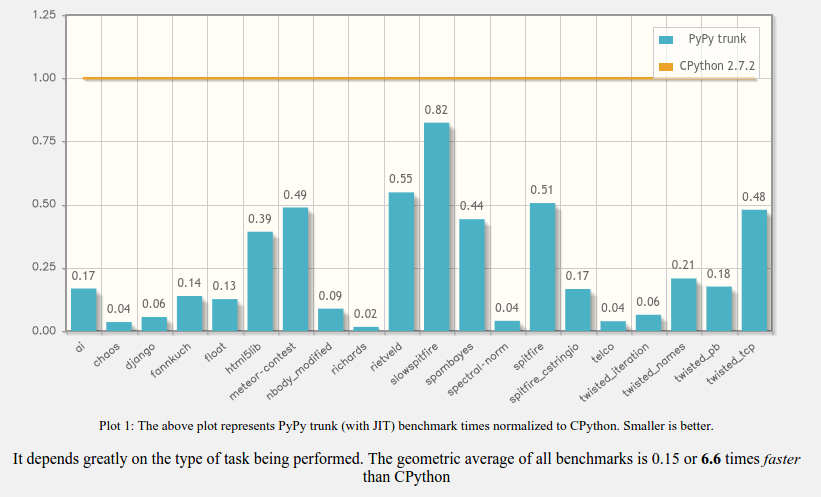

.. include:: beamerdefs.txt

PyPy : A fast Python Virtual Machine
====================================

Me
--

- rguillebert on twitter and irc

- PyPy contributor since 2011

- NumPyPy contributor

- Software consultant (hire me !)

- Feel free to interrupt

Introduction
------------

- "PyPy is a fast, compliant alternative implementation of the Python language"

- Aims to reach the best performance possible without changing the syntax or semantics

- Supports x86, x86_64, ARM

- Production ready

- MIT Licensed

Speed
-----

Speed
-----

- Automatically generated tracing just-in-time compiler

- Generates efficient machine code based on runtime observations

- Removes overhead when unnecessary

- But Python features which need require overhead remain available (frame introspection, pdb)

RPython
-------

- Subset of Python

- Made for writting virtual machines

- Takes care of garbage collection and JIT compilation

- A VM written in RPython doesn't have to know about the garbage collector

- Minimal help from the VM is needed in order to have an efficient JIT (a few annotations)

Demo
----

- Real-time edge detection

How
---

- Generates linear traces from loops

- Specializes traces on types

- Removes boxing, integer objects become machine integers

- If the type of the object is different from the type in the trace being executed, go back to the interpreter : "guard failure"

- If a guard fails too many times, generate traces for the other types frequently encountered

Compatibility
-------------

- Fully compatible with CPython 2.7 & 3.2 (minus implementation details)

- Partial and slow support of the C-API

- Alternatives might exist

Future
------

- More Python 3

- NumPyPy

- STM

Ecosystem
---------

- We should (slowly, incrementally) move away from the C extension API

  * Makes assumptions on refcounting, object layout, the GIL

  * The future of Python is bound to the future of CPython (a more than 20 years old interpreter)

  * It's hard for a new Python VM without C extension support to get traction (not only PyPy)

- This doesn't mean we should lose Python's ability to interface with C easily

- CFFI is the PyPy team's attempt at solving this

CFFI (1/2)
----------

- Where do we go from here ?

- CFFI is a fairly new way of interacting with C in an implementation independant way

- Very fast on PyPy

- Decently fast on CPython

- The Jython project is working on support

CFFI (2/2)
----------

- More convenient, safer, faster than ctypes

- Can call C functions easily, API and ABI mode

- Python functions can be exposed to C

- Already used by pyopenssl, psycopg2cffi, pygame_cffi, lxml_cffi

- Other tools could be built on top of it (Cython cffi backend ?)

Questions
---------

- Questions ?
