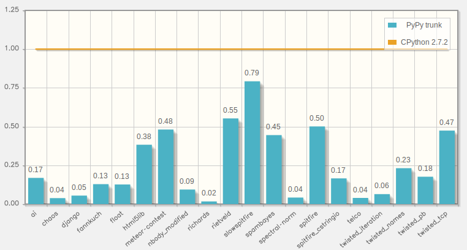

.. include:: beamerdefs.txt

================================
PyPy
================================

Who We Are
----------

* Maciej Fijałkowski

* Armin Rigo

* PyPy developers for a long time

* baroquesoftware

What is PyPy?
--------------

* Python interpreter, alternative to CPython

* Supports Python 2.7 and (beta) Python 3.2/3.3

* Compatible and generally much faster (JIT)

Benchmarks
--------------------------------

Demo
--------------------------------

Recent developments
--------------------------------

Between PyPy 2.0 (May 2013) and PyPy 2.4 (now):

.

* All kinds of speed improvements for all kinds of programs

  - JIT improvements, incremental GC (garbage collector),
    specific Python corners improved, ...

* Support for ARM in addition to x86

  - Thanks to the Raspberry-Pi foundation

* Python 3 support 

  - py3k, in addition to Python 2.7

* Numpy more complete (but still not done)

Status
-----------------------------

- Python code "just works"

  * generally much faster than with CPython

- C code: improving support

  * cpyext: tries to load CPython C extension modules, slowly

  * CFFI: the future

  * cppyy for C++

  * A very small native PyPy C API for embedding, WIP

- Lots of CFFI modules around:

  * pyopenssl, pygame_cffi, psycopg2cffi, lxml...

Fundraising Campaign
---------------------

- py3k: 55'000 $ of 105'000 $ (52%)

- numpy: 48'000 $ of 60'000 $ (80%)

- STM, 1st call: 38'000 $

- STM, 2nd call: 17'000 $ of 80'000 $ (22%)

- Thanks to all donors!

Commercial support
------------------

- We offer commercial support for PyPy

- Consultancy and training

- Performance issues for open- or closed-source programs, porting,
  improving support in parts of the Python or non-Python interpreters,
  etc.

- http://baroquesoftware.com

Recent developments (2)
--------------------------------

* CFFI

  - C Foreign Function Interface

* STM

  - Software Transactional Memory

CFFI
-----

- Python <-> C interfacing done right

  * existing shared libraries

  * custom C code

- Alternative to the CPython Extension API, ctypes, Cython, etc.

- Fast-ish on CPython, super-fast on PyPy, Jython support in the future

- Simple, does not try to be magic

CFFI
----

.. image:: standards.png
   :scale: 50%
   :align: center

CFFI demo
---------

CFFI idea
---------

* C and Python are enough, we don't need an extra language

* C is well defined, let's avoid magic

* all the logic (and magic!) can be done in Python

* API vs ABI

* Inspired by LuaJIT's FFI

Work in Progress: STM
---------------------

- Software Transactional Memory

- Solving the GIL problem

  * GIL = Global Interpreter Lock

- Without bringing the threads and locks mess

- Preliminary versions of pypy-jit-stm available

STM (2)
-------

- STM = Free Threading done right

  * with some overhead: 30-40% so far

- Done at the level of RPython

- The interpreter author doesn't have to worry
  about adding tons of locks
  
  - that's us

- The user *can* if he likes, but doesn't have to either

  - that's you ``:-)``

STM (3)
-------

- Works "like a GIL" but runs optimistically in parallel

- A few bytecodes from thread A run on core 1

- A few bytecodes from thread B run on core 2

- If there is no conflict, we're happy

- If there is a conflict, one of the two aborts and retries

- Same effect as transactions in databases

STM (4)
-------

- Threading made simpler for the user

- It is generally efficient with *very coarse locks*

  * no fine-grained locking needed

- Easy to convert a number of existing single-threaded programs

  * start multiple threads, run blocks of code in each

  * use a single lock around everything

  * normally, you win absolutely nothing

  * but STM can (try to) *execute the blocks in parallel* anyway

STM (Demo)
----------

PyPy and RPython
---------------------------

* PyPy is an interpreter/JIT-compiled for Python

* PyPy is written in RPython

* RPython is a language for writing interpreters:
  it provides GC-for-free, JIT-for-free, etc.

* Ideal for writing VMs for dynamic languages

More PyPy-Powered Languages
----------------------------

- Topaz: implementing Ruby

  * most of the language implemented

  * "definitely faster than MRI"

  * https://github.com/topazproject/topaz

- HippyVM: implementing PHP

  * ~7x faster than standard PHP

  * comparable speed as HHVM

  * http://hippyvm.com/

- And more

Future
------

* future is hard to predict

* continue working on general improvements

* improved IO performance in the pipeline

* warmup improvements

* numpy

Warmup improvements
-------------------

* biggest complain - slow to warmup, memory hog

* we have ideas how to improve the situation

* still looking for funding

Numpy
-----

* numpy is mostly complete

* performance can be improved, especially the vectorized versions

* scipy, matplotlib, the entire ecosystem, we have a hackish idea

Contacts, Q&A
--------------

- http://pypy.org

- http://morepypy.blogspot.com/

- ``#pypy`` at freenode.net

- Any question?
