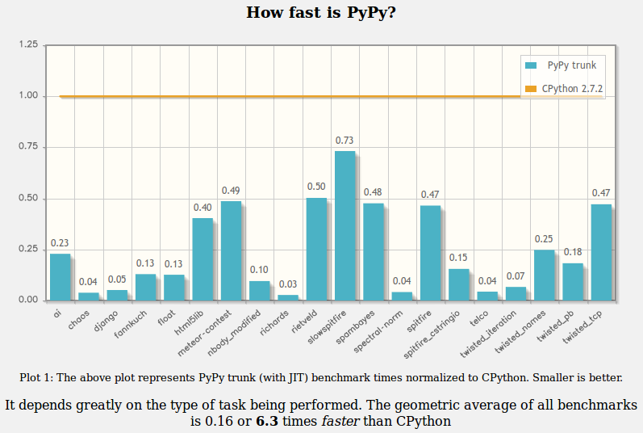

.. include:: beamerdefs.txt

=======================================
Software Transactional Memory with PyPy
=======================================

Software Transactional Memory with PyPy
---------------------------------------

* PyCon ZA 2013

* talk by Armin Rigo

* sponsored by crowdfunding (thanks!)

Introduction
------------

* what is PyPy: an alternative implementation of Python

* main focus is on speed

Introduction
------------

SQL by example
--------------

::

    BEGIN TRANSACTION;
    SELECT * FROM ...;
    UPDATE ...;
    COMMIT;

Python by example
-----------------

::

    ...
    x = obj.value
    obj.value = x + 1
    ...

Python by example
-----------------

::

    begin_transaction()
    x = obj.value
    obj.value = x + 1
    commit_transaction()

Python by example
-----------------

::

    the_lock.acquire()
    x = obj.value
    obj.value = x + 1
    the_lock.release()

Python by example
-----------------

::

    with the_lock:
        x = obj.value
        obj.value = x + 1

Python by example
-----------------

::

    with atomic:
        x = obj.value
        obj.value = x + 1

Locks != Transactions
---------------------

::

    BEGIN TRANSACTION;    BEGIN TRANSACTION;    BEGIN..
    SELECT * FROM ...;    SELECT * FROM ...;    SELEC..
    UPDATE ...;           UPDATE ...;           UPDAT..
    COMMIT;               COMMIT;               COMMI..

Locks != Transactions
---------------------

::

    with the_lock:        with the_lock:        with ..
      x = obj.val           x = obj.val           x =..
      obj.val = x + 1       obj.val = x + 1       obj..

Locks != Transactions
---------------------

::

    with atomic:          with atomic:          with ..
      x = obj.val           x = obj.val           x =..
      obj.val = x + 1       obj.val = x + 1       obj..

STM
---

* Transactional Memory

* advanced but not magic (same as databases)

STM versus HTM
--------------

* Software versus Hardware

* CPU hardware specially to avoid the high overhead

* too limited for now

Example 1
---------

::

  def apply_interest_rate(self):
     self.balance *= 1.05

  for account in all_accounts:
     account.apply_interest_rate()

Example 1
---------

::

  def apply_interest_rate(self):
     self.balance *= 1.05

  for account in all_accounts:
     add_task(account.apply_interest_rate)
  run_tasks()

Internally
----------

* `run_all_tasks()` manages a pool of threads

* each thread runs tasks in a `with atomic`

* uses threads, but internally only

Example 2
---------

::

  def next_iteration(all_trains):
     for train in all_trains:
        start_time = ...
        for othertrain in train.dependencies:
           if ...:
              start_time = ...
        train.start_time = start_time

Example 2
---------

::

  def compute_time(train):
     ...
     train.start_time = ...

  def next_iteration(all_trains):
     for train in all_trains:
        add_task(compute_time, train)
     run_all_tasks()

Conflicts
---------

* like database transactions

* but with `objects` instead of `records`

* the transaction aborts and automatically retries

Inevitable
----------

* means "unavoidable"

* handles I/O in a `with atomic`

* cannot abort the transaction any more

By the way
----------

* STM replaces the GIL

* any existing multithreaded program runs on multiple cores

Current status
--------------

* basics work, JIT compiler integration almost done

* different executable called `pypy-stm`

* slow-down: around 3x (in bad cases up to 10x)

* speed-ups measured with 4 cores

* Linux 64-bit only

User feedback
-------------

* implemented:

::

    Detected conflict:
      File "foo.py", line 17, in walk
        if node.left not in seen:
    Transaction aborted, 0.000047 seconds lost

User feedback
-------------

* not implemented yet:

::

    Forced inevitable:
      File "foo.py", line 19, in walk
        print >> log, logentry
    Transaction blocked others for 0.xx seconds

Async libraries
---------------

* future work

* tweak a Twisted reactor: run multithreaded,
  but use `with atomic`

* existing Twisted apps still work, but we need to
  look at conflicts/inevitables

* similar with Tornado, gevent, and so on

Async libraries
---------------

::

  while True:
     events = epoll.poll()
     for event in events:
        queue.put(event)

And in several threads::

  while True:
     event = queue.get()
     with atomic:
        handle(event)

More future work
----------------

* look at many more examples

* tweak data structures to avoid conflicts

* reduce slow-down, port to other OS'es

Under the cover
---------------

* 10'000-feet overview

* every object can have multiple versions

* the shared versions are immutable

* the most recent version can belong to one thread

* synchronization only when a thread "steals" another thread's most
  recent version, to make it shared

* integrated with a generational garbage collector, with one
  nursery per thread

Summary
-------

* transactions in Python

* a big change under the cover

* a small change for Python users

* `Q & A`
