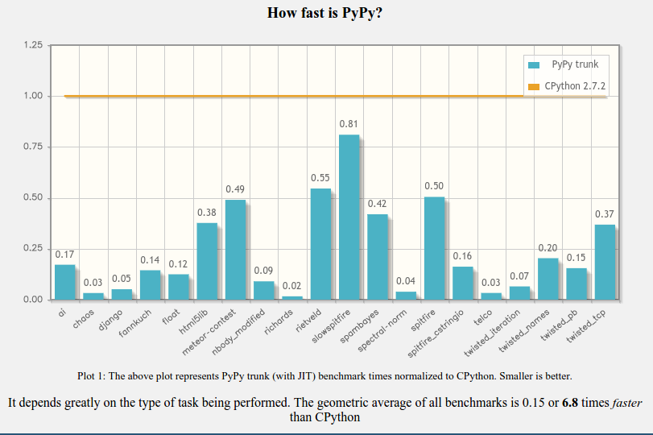

.. include:: beamerdefs.txt

=============================
PyPy and the scientific stack
=============================

Introduction
------------

* PyPy contributor

* Hired to work on NumPyPy

* Interested in library compatibility

* @rguillebert on twitter, feel free to send me questions

* Software consultant

PyPy
----

* PyPy is an implementation of the Python language

* Speed is one of its main advantages

* Compatibility is very important to us

Python
------

* Python is a great language

* Very dynamic

* Easy to introspect (pdb is just another Python module)

* Considered slow

Speed
-----

How ?
-----

* Tracing Just-In-Time compiler

* Removes overhead

Demo
----

* Real-time edge detection

How to get performance out of Python code ?
-------------------------------------------

* Rewrite your code in C

* Rewrite your code in Cython

* Rewrite your code in some subset/dialect of Python like Numba

* Just write Python and use PyPy, only pay the cost of what you use

PyPy and C (1/2)
----------------

* PyPy is pretty good at interacting with C code now, thanks to CFFI

* CFFI is the easiest tool to I've used so far

* Very fast on PyPy, fast enough on CPython

* Used by NumPyPy

* With CFFI you can call C code from Python and expose Python functions to C 

  - This means you can create your own C API in pure Python !

PyPy and C (2/2)
----------------

* It is now possible to embed PyPy in a C application (uWSGI)

* C extensions written using the Python C API can work, but they're slow and support is incomplete

* We have ideas to help with that in some use cases

Python C API
------------

* Leaks way too many implementation details (refcounting, PyObject structure fields)

* Makes it hard to improve Python while supporting 100% of the API

* Should we have a new C API ?

NumPyPy
-------

* ~80% of the numpy tests are passing

* Most of numpy is there

* XXX is missing

NumPyPy performance
-------------------

* Vectorized operations should be as fast as Numpy

* Using ndarrays as you would use arrays in C or Java should be as fast

* Lazy evaluation ?

PyMetabiosis
------------

* Work in progress

* Allows you to use any CPython module on PyPy

* Embeds CPython into PyPy with CFFI

* Numpy arrays can be shared between PyPy and CPython

PyMetabiosis
------------

|scriptsize|

.. sourcecode:: python

    from pymetabiosis import import_module

    cpython_virtualenv_path = 
        "/home/rguillebert/.virtualenvs/venv/bin/activate_this.py"

    builtin = import_module("__builtin__")

    # Activate a virtualenv for the cpython interpreter
    builtin.execfile(cpython_virtualenv_path,
        {"__file__" : cpython_virtualenv_path}
    )

    pylab = import_module("matplotlib.pylab")

    pylab.plot([1, 2, 3, 4])
    pylab.show()

|end_scriptsize|

JitPy
-----

* Work in progress

* Embeds PyPy into CPython

* Provides a decorator that allows you to run specific functions on PyPy

* Is used the same way as numba, but different performance caracteristics

JitPy
-----

|scriptsize|

.. sourcecode:: python

    from jitpy import setup
    setup('<path-to-pypy-home>')
    from jitpy.wrapper import jittify

    @jittify([int, float], float)
    def func(count, no):
        s = 0
        for i in range(count):
           s += no
        return s

    func(100000, 1.2)

|end_scriptsize|

Thank You
---------

Questions ?
