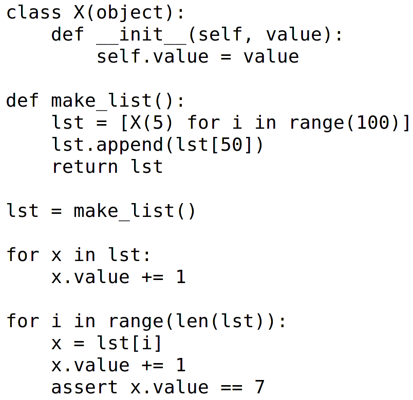

=========================
RevDB, a reverse debugger
=========================

Introduction
===========================

* I am Armin Rigo, part of the PyPy project since the start (14 years)

  * PyPy is another implementation of Python

  * != CPython, but mostly compatible

* RevDB is a modified PyPy

What is a reverse debugger?
===========================

* Demo

What is a reverse debugger?
===========================

How is that possible??
======================

* See later

Note
====

* I did not cheat

* It really works

* It really works for large programs

Recording & Replaying
=====================

* Demo

Main features
=============

* Travel in time: next/bnext, step/bstep, continue/bcontinue,
  finish/bfinish

* p *expression-or-statement*

* watch *expression*

  * using ``$0``, ``$1``, ...

* break *function*, break *file:line*

On more involved problems
=========================

* Write down what occurs at which time, because you're going
  to go back and forth until you are lost

* See ``help`` for all commands

Completeness
============

What works:

* Run any Python code that PyPy can also run

* Multithreaded apps

* CPython C extension modules

  * Might get "Attempted to do I/O or access raw memory" in the debugger

Completeness
============

What doesn't works (so far?):

* Long-running programs

* Stackless/greenlet/gevent

* Track multiple processes

* Windows (contract possible)

* Python 3 (soon)

Comparison
==========

* "Reverse debugging" == "Omniscient debugging" == "Historial debugging"
  == "Backwards debugging"

* for the C language: undodb-gdb, rr

* for Python (but not really the same thing): epdb, pode

Why not well-known?
===================

* It is often a cannon to take down a fly

* Performance issues: unlike gdb and pdb, they slow down normal
  execution (with some of them, massively)

(RevDB has the same issues)

Why not well-known?
===================

* They tend to crash

* Not all give a full, reliable history: sometimes you need to guess if
  the debugger is telling you lies

* Often proprietary software with restrictive licenses

(RevDB hopefully does not have these issues)

Sometimes you need the cannon
=============================

* In a very complex piece of code, likely you *will* hunt for a week for
  *one* bug

* I made RevDB in two months instead of spending one week tracking down a
  bug ``:-)``

  * Found the bug in one hour

Q & A
=====

https://bitbucket.org/pypy/revdb/

How does it work?  (slide 1/2)
==============================

* In PyPy, memory is naturally divided into "GC memory" and "raw memory"

* Recording: write in the log the *result* of:

  * each C library call

  * each raw memory read

* More recording: weakrefs, __del__ calls, thread switches, callbacks
  from C...

* (Done by tweaking RPython, the language in which PyPy is itself written)

How does it work?  (slide 2/2)
==============================

* Replaying: read from the log the *result* of the same operations

* Everything else should be deterministic

* Illusion of going backward:

  * fork is the key

  * to go back, throw away the current fork, restart from an
    earlier fork, go forward again
